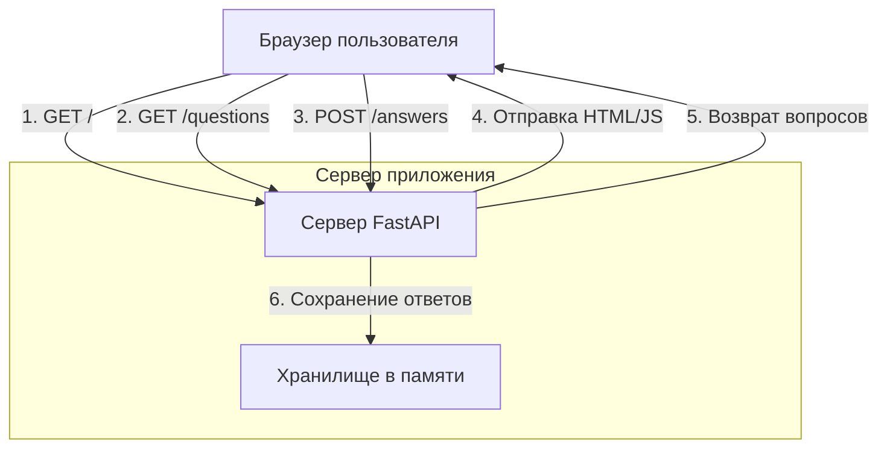
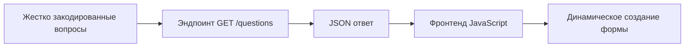
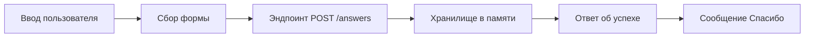
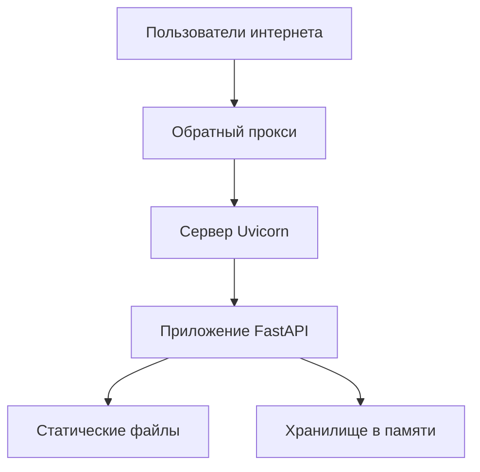

# Архитектура приложения Мини-анкета

## Обзор

Приложение Мини-анкета представляет собой простую веб-систему опросов, которая позволяет пользователям заполнять анкеты и отправлять свои ответы. Приложение состоит из бэкенда на FastAPI, который обслуживает как API-эндпоинты, так и фронтенд HTML/JS интерфейс.

## Компоненты системы

### 1. Бэкенд (FastAPI)
- **Фреймворк**: FastAPI с сервером Uvicorn ASGI
- **Язык**: Python 3.12
- **Ответственность**:
  - Обслуживание фронтенд HTML/JS файлов
  - Предоставление REST API эндпоинтов для вопросов и ответов
  - Хранение ответов пользователей в памяти

### 2. Фронтенд (HTML/JS)
- **Технологии**: HTML5, CSS3, Vanilla JavaScript
- **Ответственность**:
  - Отображение формы опроса
  - Загрузка вопросов с бэкенда
  - Сбор ответов пользователей
  - Отправка ответов на бэкенд
  - Отображение сообщения подтверждения после отправки

### 3. Хранилище данных
- **Тип**: Хранение в памяти
- **Структура**: Словарь словарей, сопоставляющий имена пользователей с их ответами

## Диаграмма архитектуры



## Взаимодействие компонентов

### 1. Первоначальная загрузка страницы
1. Пользователь запрашивает корневой URL (`/`)
2. FastAPI отправляет файл `index.html`
3. Браузер отображает HTML и выполняет JavaScript
4. JavaScript делает запрос к эндпоинту `/questions`
5. FastAPI возвращает список вопросов
6. JavaScript динамически создает поля формы для каждого вопроса

### 2. Отправка ответов
1. Пользователь заполняет форму и нажимает "Отправить"
2. JavaScript собирает все ответы и запрашивает имя пользователя
3. JavaScript отправляет POST-запрос на `/answers` с данными
4. FastAPI проверяет и сохраняет ответы в памяти
5. FastAPI возвращает сообщение об успехе
6. JavaScript скрывает форму и показывает сообщение "Спасибо!"

## Поток данных

### Поток данных вопросов


### Поток данных ответов


## Структура хранения данных

### Вопросы
Вопросы жестко закодированы в бэкенде как список словарей:
```python
[
    {"id": 1, "text": "Как вас зовут?"},
    {"id": 2, "text": "Сколько вам лет?"},
    {"id": 3, "text": "Какой ваш любимый язык программирования?"},
    {"id": 4, "text": "Оцените этот опрос от 1 до 10"}
]
```

### Хранилище ответов
Ответы хранятся в памяти как словарь словарей:
```python
{
    "username": {
        question_id: "answer_text",
        ...
    },
    ...
}
```

## API эндпоинты

### GET /questions
- **Назначение**: Получение списка вопросов опроса
- **Ответ**: JSON массив объектов вопросов
- **Пример ответа**:
```json
[
  {"id": 1, "text": "Как вас зовут?"},
  {"id": 2, "text": "Сколько вам лет?"}
]
```

### POST /answers
- **Назначение**: Отправка ответов пользователя
- **Тело запроса**: JSON объект с именем пользователя и ответами
- **Пример запроса**:
```json
{
  "username": "Иван",
  "answers": [
    {"question_id": 1, "answer_text": "Иван"},
    {"question_id": 2, "answer_text": "25"}
  ]
}
```
- **Ответ**: Сообщение об успехе
```json
{"message": "Ответы успешно сохранены"}
```

### GET /
- **Назначение**: Обслуживание главной HTML страницы
- **Ответ**: HTML содержимое с встроенным JavaScript

## Архитектура развертывания



## Соображения безопасности

1. **Нет аутентификации**: Приложение не реализует аутентификацию или авторизацию
2. **Хранение в памяти**: Данные не сохраняются и будут потеряны при перезапуске сервера
3. **Нет проверки ввода**: Минимальная проверка пользовательского ввода
4. **Нет HTTPS**: Приложение работает по HTTP по умолчанию

## Ограничения масштабируемости

1. **Хранение в памяти**: Все данные хранятся в памяти, что ограничивает масштабируемость
2. **Один сервер**: Приложение работает на одном экземпляре сервера
3. **Нет кэширования**: Нет механизма кэширования для часто запрашиваемых данных
4. **Нет базы данных**: Нет решения для постоянного хранения

## Возможные улучшения

1. **Постоянное хранение**: Заменить хранение в памяти на базу данных
2. **Аутентификация пользователей**: Добавить аутентификацию и авторизацию пользователей
3. **Проверка ввода**: Реализовать комплексную проверку ввода
4. **Обработка ошибок**: Улучшить обработку ошибок и обратную связь с пользователем
5. **Тестирование**: Добавить модульные и интеграционные тесты
6. **Документация**: Создать комплексную документацию API