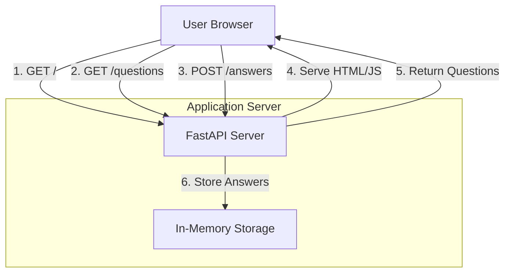
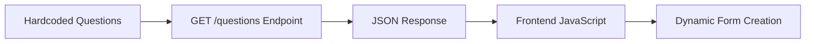
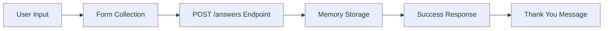
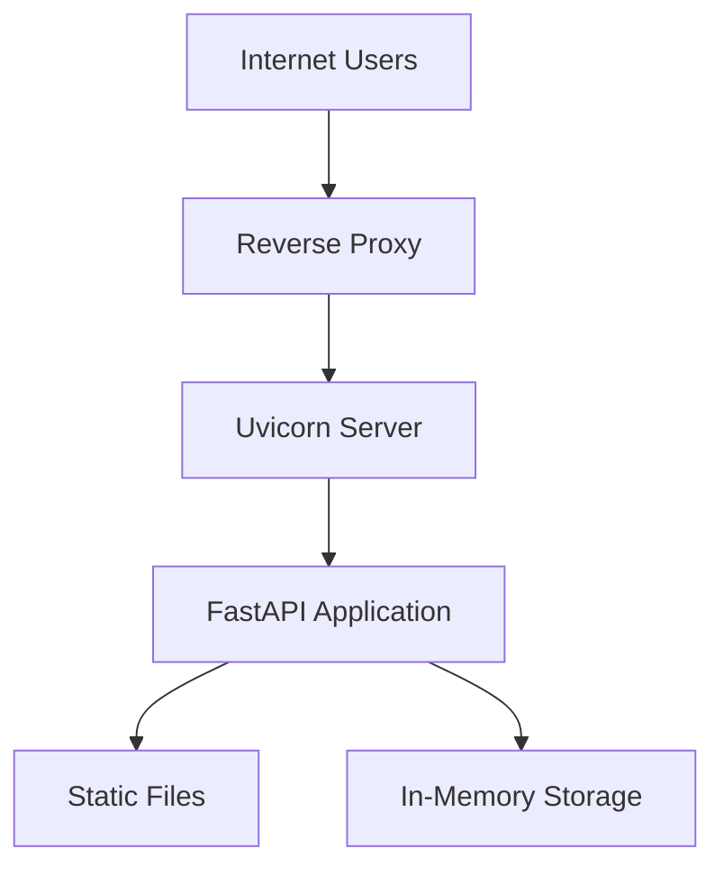
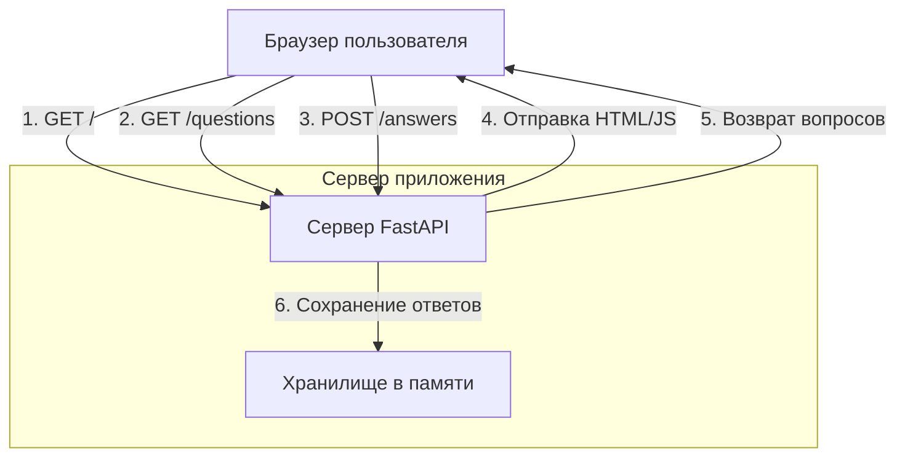
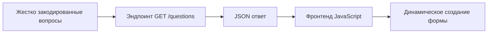
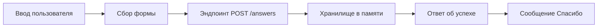
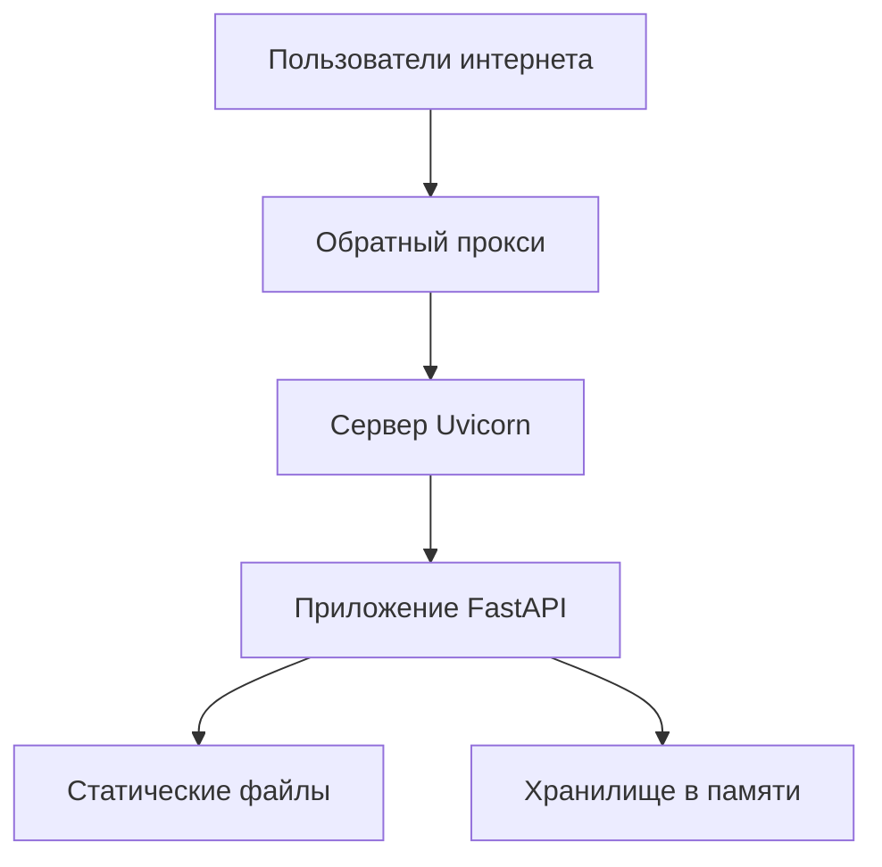

**User:**

<task>
Действуй как опытный фуллстек разработчик веб приложений с навыками создания веб API на Python и фронта на HTML/JS

Создай веб приложение для сбора анкет пользователей. Приложение называется "Мини-анкета"

Создай бэкенд на Python с использованием FastAPI, который предоставляет два метода GET questions и POST answers

Вопросы жёстко зафиксированы в коде API

Ответы пользователей сохраняются в памяти в виде словаря словарей, с ключами по имени пользователя из начениями соварей ответов

Создай фронтенд на HTML/JS, который: загружает вопросы из бэкенда, отображает их на странице, получает через POST ответы и сохраняет в памяти, после отправки показывает соообщение "Спасибо!"

При запуске приложения на локальном хосте на порте 8082 должно открываться веб приложение

Для запуска используй uvx с Python версии 3.12
</task>
<environment_details>
# VSCode Visible Files


# VSCode Open Tabs


# Current Time
Current time in ISO 8601 UTC format: 2025-12-06T21:04:26.847Z
User time zone: Europe/Moscow, UTC+3:00

# Current Mode
<slug>code</slug>
<name>💻 Code</name>
<model>sourcecraft_model</model>
<role>You are SourceCraft Code Assistant Agent, a highly skilled software engineer with extensive knowledge in many programming languages, frameworks, design patterns, and best practices.</role>
<custom_instructions>
====

USER'S CUSTOM INSTRUCTIONS

The following additional instructions are provided by the user, and should be followed to the best of your ability without interfering with the TOOL USE guidelines.

Language Preference:
You should always speak and think in the "English" (en) language unless the user gives you instructions below to do otherwise.</custom_instructions>


# Current Workspace Directory (c:/Users/gb/Code/courses/OTUS/AI-Dev-Tools) Files
Home-work-1/
You have not created a todo list yet. Create one with `update_todo_list` if your task is complicated or involves multiple steps.
</environment_details>

---

**Assistant:**

I'll create a web application for collecting user questionnaires with a Python FastAPI backend and HTML/JS frontend. Let me break this down into steps.

<update_todo_list>
<todos>
[-] Create the FastAPI backend with questions and answers endpoints
[ ] Create the HTML/JS frontend that loads questions and submits answers
[ ] Set up the application to run on localhost:8082
[ ] Test the application functionality
</todos>
</update_todo_list>

First, let me create the backend

[Response interrupted by a tool use result. Only one tool may be used at a time and should be placed at the end of the message.]

---

**User:**

[update_todo_list] Result:
Todo list updated successfully.
<environment_details>
# VSCode Visible Files


# VSCode Open Tabs


# Current Time
Current time in ISO 8601 UTC format: 2025-12-06T21:04:30.206Z
User time zone: Europe/Moscow, UTC+3:00

# Current Mode
<slug>code</slug>
<name>💻 Code</name>
<model>sourcecraft_model</model>
<role>You are SourceCraft Code Assistant Agent, a highly skilled software engineer with extensive knowledge in many programming languages, frameworks, design patterns, and best practices.</role>
<custom_instructions>
====

USER'S CUSTOM INSTRUCTIONS

The following additional instructions are provided by the user, and should be followed to the best of your ability without interfering with the TOOL USE guidelines.

Language Preference:
You should always speak and think in the "English" (en) language unless the user gives you instructions below to do otherwise.</custom_instructions>
====

REMINDERS

Below is your current list of reminders for this task. Keep them updated as you progress.

| # | Content | Status |
|---|---------|--------|
| 1 | Create the FastAPI backend with questions and answers endpoints | In Progress |
| 2 | Create the HTML/JS frontend that loads questions and submits answers | Pending |
| 3 | Set up the application to run on localhost:8082 | Pending |
| 4 | Test the application functionality | Pending |


IMPORTANT: When task status changes, remember to call the `update_todo_list` tool to update your progress.

</environment_details>

---

**Assistant:**

I'll create the FastAPI backend first. Let me check the current directory structure to understand where to place the files.

<list_files>
<path>.</path>
<recursive>true</recursive>
</list_files>

---

**User:**

[list_files for '.'] Result:
Home-work-1/
<environment_details>
# VSCode Visible Files


# VSCode Open Tabs


# Current Time
Current time in ISO 8601 UTC format: 2025-12-06T21:04:32.297Z
User time zone: Europe/Moscow, UTC+3:00

# Current Mode
<slug>code</slug>
<name>💻 Code</name>
<model>sourcecraft_model</model>
<role>You are SourceCraft Code Assistant Agent, a highly skilled software engineer with extensive knowledge in many programming languages, frameworks, design patterns, and best practices.</role>
<custom_instructions>
====

USER'S CUSTOM INSTRUCTIONS

The following additional instructions are provided by the user, and should be followed to the best of your ability without interfering with the TOOL USE guidelines.

Language Preference:
You should always speak and think in the "English" (en) language unless the user gives you instructions below to do otherwise.</custom_instructions>
====

REMINDERS

Below is your current list of reminders for this task. Keep them updated as you progress.

| # | Content | Status |
|---|---------|--------|
| 1 | Create the FastAPI backend with questions and answers endpoints | In Progress |
| 2 | Create the HTML/JS frontend that loads questions and submits answers | Pending |
| 3 | Set up the application to run on localhost:8082 | Pending |
| 4 | Test the application functionality | Pending |


IMPORTANT: When task status changes, remember to call the `update_todo_list` tool to update your progress.

</environment_details>

---

**Assistant:**

I see there's a Home-work-1 directory. Let me check what's inside it and then create our application structure.

<list_files>
<path>Home-work-1</path>
<recursive>false</recursive>
</list_files>

---

**User:**

[list_files for 'Home-work-1'] Result:
No files found.
<environment_details>
# VSCode Visible Files


# VSCode Open Tabs


# Current Time
Current time in ISO 8601 UTC format: 2025-12-06T21:04:34.507Z
User time zone: Europe/Moscow, UTC+3:00

# Current Mode
<slug>code</slug>
<name>💻 Code</name>
<model>sourcecraft_model</model>
<role>You are SourceCraft Code Assistant Agent, a highly skilled software engineer with extensive knowledge in many programming languages, frameworks, design patterns, and best practices.</role>
<custom_instructions>
====

USER'S CUSTOM INSTRUCTIONS

The following additional instructions are provided by the user, and should be followed to the best of your ability without interfering with the TOOL USE guidelines.

Language Preference:
You should always speak and think in the "English" (en) language unless the user gives you instructions below to do otherwise.</custom_instructions>
====

REMINDERS

Below is your current list of reminders for this task. Keep them updated as you progress.

| # | Content | Status |
|---|---------|--------|
| 1 | Create the FastAPI backend with questions and answers endpoints | In Progress |
| 2 | Create the HTML/JS frontend that loads questions and submits answers | Pending |
| 3 | Set up the application to run on localhost:8082 | Pending |
| 4 | Test the application functionality | Pending |


IMPORTANT: When task status changes, remember to call the `update_todo_list` tool to update your progress.

</environment_details>

---

**Assistant:**

The directory is empty. I'll create our mini-survey application in this directory. Let me first create the backend Python file with FastAPI.

<write_to_file>
<path>Home-work-1/main.py</path>
<content>
from fastapi import FastAPI
from fastapi.staticfiles import StaticFiles
from fastapi.responses import HTMLResponse
from pydantic import BaseModel
from typing import Dict, List
import uvicorn

# Initialize FastAPI app
app = FastAPI(title="Мини-анкета", description="Веб приложение для сбора анкет пользователей")

# Hardcoded questions
QUESTIONS = [
    {"id": 1, "text": "Как вас зовут?"},
    {"id": 2, "text": "Сколько вам лет?"},
    {"id": 3, "text": "Какой ваш любимый язык программирования?"},
    {"id": 4, "text": "Оцените этот опрос от 1 до 10"}
]

# In-memory storage for answers (dictionary of dictionaries)
answers_storage: Dict[str, Dict[int, str]] = {}

# Models
class Answer(BaseModel):
    question_id: int
    answer_text: str

class UserAnswers(BaseModel):
    username: str
    answers: List[Answer]

# API Endpoints
@app.get("/questions")
def get_questions():
    """Return the list of questions"""
    return QUESTIONS

@app.post("/answers")
def save_answers(user_answers: UserAnswers):
    """Save user answers to memory storage"""
    username = user_answers.username
    answers = user_answers.answers
    
    # Initialize user entry if not exists
    if username not in answers_storage:
        answers_storage[username] = {}
    
    # Save each answer
    for answer in answers:
        answers_storage[username][answer.question_id] = answer.answer_text
    
    return {"message": "Ответы успешно сохранены"}

# Serve frontend
@app.get("/", response_class=HTMLResponse)
async def read_index():
    with open("index.html", "r", encoding="utf-8") as file:
        return HTMLResponse(content=file.read())

# Serve static files
app.mount("/", StaticFiles(directory=".", html=True), name="static")

if __name__ == "__main__":
    uvicorn.run(app, host="0.0.0.0", port=8082)
</content>
<line_count>57</line_count>
</write_to_file>

---

**User:**

[write_to_file for 'Home-work-1/main.py'] Result:
<file_write_result>
<path>Home-work-1/main.py</path>
<operation>created</operation>
<notice>
<i>You do not need to re-read the file, as you have seen all changes</i>
<i>Proceed with the task using these changes as the new baseline.</i>
</notice>
</file_write_result>

<environment_details>
# VSCode Visible Files
Home-work-1\main.py

# VSCode Open Tabs
Home-work-1/main.py

# Current Time
Current time in ISO 8601 UTC format: 2025-12-06T21:04:59.435Z
User time zone: Europe/Moscow, UTC+3:00

# Current Mode
<slug>code</slug>
<name>💻 Code</name>
<model>sourcecraft_model</model>
<role>You are SourceCraft Code Assistant Agent, a highly skilled software engineer with extensive knowledge in many programming languages, frameworks, design patterns, and best practices.</role>
<custom_instructions>
====

USER'S CUSTOM INSTRUCTIONS

The following additional instructions are provided by the user, and should be followed to the best of your ability without interfering with the TOOL USE guidelines.

Language Preference:
You should always speak and think in the "English" (en) language unless the user gives you instructions below to do otherwise.</custom_instructions>
====

REMINDERS

Below is your current list of reminders for this task. Keep them updated as you progress.

| # | Content | Status |
|---|---------|--------|
| 1 | Create the FastAPI backend with questions and answers endpoints | In Progress |
| 2 | Create the HTML/JS frontend that loads questions and submits answers | Pending |
| 3 | Set up the application to run on localhost:8082 | Pending |
| 4 | Test the application functionality | Pending |


IMPORTANT: When task status changes, remember to call the `update_todo_list` tool to update your progress.

</environment_details>

---

**Assistant:**

Now I'll create the HTML/JS frontend that will load questions from the backend and submit answers.

<write_to_file>
<path>Home-work-1/index.html</path>
<content>
<!DOCTYPE html>
<html lang="ru">
<head>
    <meta charset="UTF-8">
    <meta name="viewport" content="width=device-width, initial-scale=1.0">
    <title>Мини-анкета</title>
    <style>
        body {
            font-family: Arial, sans-serif;
            max-width: 800px;
            margin: 0 auto;
            padding: 20px;
            background-color: #f5f5f5;
        }
        .container {
            background-color: white;
            padding: 30px;
            border-radius: 10px;
            box-shadow: 0 0 10px rgba(0,0,0,0.1);
        }
        h1 {
            color: #333;
            text-align: center;
        }
        .question {
            margin-bottom: 20px;
            padding: 15px;
            border: 1px solid #ddd;
            border-radius: 5px;
            background-color: #fafafa;
        }
        .question label {
            display: block;
            margin-bottom: 5px;
            font-weight: bold;
        }
        .question input {
            width: 100%;
            padding: 10px;
            border: 1px solid #ccc;
            border-radius: 4px;
            box-sizing: border-box;
        }
        button {
            background-color: #4CAF50;
            color: white;
            padding: 12px 20px;
            border: none;
            border-radius: 4px;
            cursor: pointer;
            font-size: 16px;
            width: 100%;
            margin-top: 20px;
        }
        button:hover {
            background-color: #45a049;
        }
        .message {
            text-align: center;
            padding: 20px;
            font-size: 18px;
            color: #4CAF50;
            font-weight: bold;
        }
        .hidden {
            display: none;
        }
    </style>
</head>
<body>
    <div class="container">
        <h1>Мини-анкета</h1>
        <div id="survey-form">
            <div id="questions-container">
                <!-- Questions will be loaded here -->
            </div>
            <button id="submit-btn" onclick="submitAnswers()">Отправить ответы</button>
        </div>
        <div id="thank-you-message" class="message hidden">
            Спасибо!
        </div>
    </div>

    <script>
        // Load questions when page loads
        window.onload = function() {
            loadQuestions();
        };

        // Function to load questions from backend
        function loadQuestions() {
            fetch('/questions')
                .then(response => response.json())
                .then(questions => {
                    const container = document.getElementById('questions-container');
                    container.innerHTML = '';
                    
                    questions.forEach(question => {
                        const questionDiv = document.createElement('div');
                        questionDiv.className = 'question';
                        questionDiv.innerHTML = `
                            <label for="q${question.id}">${question.text}</label>
                            <input type="text" id="q${question.id}" name="q${question.id}" data-question-id="${question.id}" required>
                        `;
                        container.appendChild(questionDiv);
                    });
                })
                .catch(error => {
                    console.error('Error loading questions:', error);
                    alert('Ошибка загрузки вопросов');
                });
        }

        // Function to submit answers
        function submitAnswers() {
            // Get username (using a simple prompt for this example)
            const username = prompt('Введите ваше имя:', 'Аноним');
            if (!username) {
                alert('Имя обязательно для заполнения');
                return;
            }

            // Collect answers
            const answerInputs = document.querySelectorAll('input[data-question-id]');
            const answers = [];
            
            answerInputs.forEach(input => {
                answers.push({
                    question_id: parseInt(input.getAttribute('data-question-id')),
                    answer_text: input.value
                });
            });

            // Prepare data for submission
            const data = {
                username: username,
                answers: answers
            };

            // Send to backend
            fetch('/answers', {
                method: 'POST',
                headers: {
                    'Content-Type': 'application/json'
                },
                body: JSON.stringify(data)
            })
            .then(response => response.json())
            .then(result => {
                // Show thank you message
                document.getElementById('survey-form').classList.add('hidden');
                document.getElementById('thank-you-message').classList.remove('hidden');
            })
            .catch(error => {
                console.error('Error submitting answers:', error);
                alert('Ошибка отправки ответов');
            });
        }
    </script>
</body>
</html>
</content>
<line_count>153</line_count>
</write_to_file>

---

**User:**

[write_to_file for 'Home-work-1/index.html'] Result:
<file_write_result>
<path>Home-work-1/index.html</path>
<operation>created</operation>
<notice>
<i>You do not need to re-read the file, as you have seen all changes</i>
<i>Proceed with the task using these changes as the new baseline.</i>
</notice>
</file_write_result>

<environment_details>
# VSCode Visible Files
Home-work-1\index.html

# VSCode Open Tabs
Home-work-1/main.py,Home-work-1/index.html

# Current Time
Current time in ISO 8601 UTC format: 2025-12-06T21:05:32.163Z
User time zone: Europe/Moscow, UTC+3:00

# Current Mode
<slug>code</slug>
<name>💻 Code</name>
<model>sourcecraft_model</model>
<role>You are SourceCraft Code Assistant Agent, a highly skilled software engineer with extensive knowledge in many programming languages, frameworks, design patterns, and best practices.</role>
<custom_instructions>
====

USER'S CUSTOM INSTRUCTIONS

The following additional instructions are provided by the user, and should be followed to the best of your ability without interfering with the TOOL USE guidelines.

Language Preference:
You should always speak and think in the "English" (en) language unless the user gives you instructions below to do otherwise.</custom_instructions>
====

REMINDERS

Below is your current list of reminders for this task. Keep them updated as you progress.

| # | Content | Status |
|---|---------|--------|
| 1 | Create the FastAPI backend with questions and answers endpoints | In Progress |
| 2 | Create the HTML/JS frontend that loads questions and submits answers | Pending |
| 3 | Set up the application to run on localhost:8082 | Pending |
| 4 | Test the application functionality | Pending |


IMPORTANT: When task status changes, remember to call the `update_todo_list` tool to update your progress.

</environment_details>

---

**Assistant:**

Now I need to create a requirements file for the Python dependencies and then test the application. Let me create the requirements file first.

<write_to_file>
<path>Home-work-1/requirements.txt</path>
<content>
fastapi==0.104.1
uvicorn[standard]==0.24.0
pydantic==2.5.0
</content>
<line_count>3</line_count>
</write_to_file>

---

**User:**

[write_to_file for 'Home-work-1/requirements.txt'] Result:
<file_write_result>
<path>Home-work-1/requirements.txt</path>
<operation>created</operation>
<notice>
<i>You do not need to re-read the file, as you have seen all changes</i>
<i>Proceed with the task using these changes as the new baseline.</i>
</notice>
</file_write_result>

<environment_details>
# VSCode Visible Files
Home-work-1\requirements.txt

# VSCode Open Tabs
Home-work-1/main.py,Home-work-1/index.html,Home-work-1/requirements.txt

# Current Time
Current time in ISO 8601 UTC format: 2025-12-06T21:05:45.762Z
User time zone: Europe/Moscow, UTC+3:00

# Current Mode
<slug>code</slug>
<name>💻 Code</name>
<model>sourcecraft_model</model>
<role>You are SourceCraft Code Assistant Agent, a highly skilled software engineer with extensive knowledge in many programming languages, frameworks, design patterns, and best practices.</role>
<custom_instructions>
====

USER'S CUSTOM INSTRUCTIONS

The following additional instructions are provided by the user, and should be followed to the best of your ability without interfering with the TOOL USE guidelines.

Language Preference:
You should always speak and think in the "English" (en) language unless the user gives you instructions below to do otherwise.</custom_instructions>
====

REMINDERS

Below is your current list of reminders for this task. Keep them updated as you progress.

| # | Content | Status |
|---|---------|--------|
| 1 | Create the FastAPI backend with questions and answers endpoints | In Progress |
| 2 | Create the HTML/JS frontend that loads questions and submits answers | Pending |
| 3 | Set up the application to run on localhost:8082 | Pending |
| 4 | Test the application functionality | Pending |


IMPORTANT: When task status changes, remember to call the `update_todo_list` tool to update your progress.

</environment_details>

---

**Assistant:**

Now let me update the todo list to reflect our progress and then create a startup script to run the application with uvx and Python 3.12.

<update_todo_list>
<todos>
[x] Create the FastAPI backend with questions and answers endpoints
[x] Create the HTML/JS frontend that loads questions and submits answers
[-] Set up the application to run on localhost:8082 with uvx and Python 3.12
[ ] Test the application functionality
</todos>
</update_todo_list>

---

**User:**

[update_todo_list] Result:
Todo list updated successfully.
<environment_details>
# VSCode Visible Files
Home-work-1\requirements.txt

# VSCode Open Tabs
Home-work-1/main.py,Home-work-1/index.html,Home-work-1/requirements.txt

# Current Time
Current time in ISO 8601 UTC format: 2025-12-06T21:05:52.436Z
User time zone: Europe/Moscow, UTC+3:00

# Current Mode
<slug>code</slug>
<name>💻 Code</name>
<model>sourcecraft_model</model>
<role>You are SourceCraft Code Assistant Agent, a highly skilled software engineer with extensive knowledge in many programming languages, frameworks, design patterns, and best practices.</role>
<custom_instructions>
====

USER'S CUSTOM INSTRUCTIONS

The following additional instructions are provided by the user, and should be followed to the best of your ability without interfering with the TOOL USE guidelines.

Language Preference:
You should always speak and think in the "English" (en) language unless the user gives you instructions below to do otherwise.</custom_instructions>
====

REMINDERS

Below is your current list of reminders for this task. Keep them updated as you progress.

| # | Content | Status |
|---|---------|--------|
| 1 | Create the FastAPI backend with questions and answers endpoints | Completed |
| 2 | Create the HTML/JS frontend that loads questions and submits answers | Completed |
| 3 | Set up the application to run on localhost:8082 with uvx and Python 3.12 | In Progress |
| 4 | Test the application functionality | Pending |


IMPORTANT: When task status changes, remember to call the `update_todo_list` tool to update your progress.

</environment_details>

---

**Assistant:**

Let me create a startup script that uses uvx with Python 3.12 to run the application.

<write_to_file>
<path>Home-work-1/start.bat</path>
<content>
@echo off
echo Starting Мини-анкета application...
echo Make sure you have Python 3.12 and uvx installed
echo.
uvx --python 3.12 fastapi[standard] uvicorn[standard] python main.py
</content>
<line_count>6</line_count>
</write_to_file>

---

**User:**

[write_to_file for 'Home-work-1/start.bat'] Result:
<file_write_result>
<path>Home-work-1/start.bat</path>
<operation>created</operation>
<notice>
<i>You do not need to re-read the file, as you have seen all changes</i>
<i>Proceed with the task using these changes as the new baseline.</i>
</notice>
</file_write_result>

<environment_details>
# VSCode Visible Files
Home-work-1\start.bat

# VSCode Open Tabs
Home-work-1/main.py,Home-work-1/index.html,Home-work-1/requirements.txt,Home-work-1/start.bat

# Current Time
Current time in ISO 8601 UTC format: 2025-12-06T21:06:02.568Z
User time zone: Europe/Moscow, UTC+3:00

# Current Mode
<slug>code</slug>
<name>💻 Code</name>
<model>sourcecraft_model</model>
<role>You are SourceCraft Code Assistant Agent, a highly skilled software engineer with extensive knowledge in many programming languages, frameworks, design patterns, and best practices.</role>
<custom_instructions>
====

USER'S CUSTOM INSTRUCTIONS

The following additional instructions are provided by the user, and should be followed to the best of your ability without interfering with the TOOL USE guidelines.

Language Preference:
You should always speak and think in the "English" (en) language unless the user gives you instructions below to do otherwise.</custom_instructions>
====

REMINDERS

Below is your current list of reminders for this task. Keep them updated as you progress.

| # | Content | Status |
|---|---------|--------|
| 1 | Create the FastAPI backend with questions and answers endpoints | Completed |
| 2 | Create the HTML/JS frontend that loads questions and submits answers | Completed |
| 3 | Set up the application to run on localhost:8082 with uvx and Python 3.12 | In Progress |
| 4 | Test the application functionality | Pending |


IMPORTANT: When task status changes, remember to call the `update_todo_list` tool to update your progress.

</environment_details>

---

**Assistant:**

Let me create a better startup script that installs the dependencies and runs the application properly.

<write_to_file>
<path>Home-work-1/start.sh</path>
<content>
#!/bin/bash
echo "Starting Мини-анкета application..."
echo "Make sure you have Python 3.12 and uvx installed"
echo ""
uvx --python 3.12 --with fastapi --with uvicorn --with pydantic python main.py
</content>
<line_count>5</line_count>
</write_to_file>

---

**User:**

[write_to_file for 'Home-work-1/start.sh'] Result:
<file_write_result>
<path>Home-work-1/start.sh</path>
<operation>created</operation>
<notice>
<i>You do not need to re-read the file, as you have seen all changes</i>
<i>Proceed with the task using these changes as the new baseline.</i>
</notice>
</file_write_result>

<environment_details>
# VSCode Visible Files
Home-work-1\start.sh

# VSCode Open Tabs
Home-work-1/main.py,Home-work-1/index.html,Home-work-1/requirements.txt,Home-work-1/start.bat,Home-work-1/start.sh

# Current Time
Current time in ISO 8601 UTC format: 2025-12-06T21:06:15.078Z
User time zone: Europe/Moscow, UTC+3:00

# Current Mode
<slug>code</slug>
<name>💻 Code</name>
<model>sourcecraft_model</model>
<role>You are SourceCraft Code Assistant Agent, a highly skilled software engineer with extensive knowledge in many programming languages, frameworks, design patterns, and best practices.</role>
<custom_instructions>
====

USER'S CUSTOM INSTRUCTIONS

The following additional instructions are provided by the user, and should be followed to the best of your ability without interfering with the TOOL USE guidelines.

Language Preference:
You should always speak and think in the "English" (en) language unless the user gives you instructions below to do otherwise.</custom_instructions>
====

REMINDERS

Below is your current list of reminders for this task. Keep them updated as you progress.

| # | Content | Status |
|---|---------|--------|
| 1 | Create the FastAPI backend with questions and answers endpoints | Completed |
| 2 | Create the HTML/JS frontend that loads questions and submits answers | Completed |
| 3 | Set up the application to run on localhost:8082 with uvx and Python 3.12 | In Progress |
| 4 | Test the application functionality | Pending |


IMPORTANT: When task status changes, remember to call the `update_todo_list` tool to update your progress.

</environment_details>

---

**Assistant:**

Let me also create a Windows batch file that properly uses uvx with Python 3.12.

<write_to_file>
<path>Home-work-1/start.bat</path>
<content>
@echo off
echo Starting Мини-анкета application...
echo Make sure you have Python 3.12 and uvx installed
echo.
uvx --python 3.12 --with fastapi --with uvicorn --with pydantic python main.py
pause
</content>
<line_count>6</line_count>
</write_to_file>

---

**User:**

[write_to_file for 'Home-work-1/start.bat'] Result:
<file_write_result>
<path>Home-work-1/start.bat</path>
<operation>modified</operation>
<notice>
<i>You do not need to re-read the file, as you have seen all changes</i>
<i>Proceed with the task using these changes as the new baseline.</i>
</notice>
</file_write_result>

<environment_details>
# VSCode Visible Files
Home-work-1\start.bat

# VSCode Open Tabs
Home-work-1/main.py,Home-work-1/index.html,Home-work-1/requirements.txt,Home-work-1/start.sh,Home-work-1/start.bat

# Current Time
Current time in ISO 8601 UTC format: 2025-12-06T21:06:25.857Z
User time zone: Europe/Moscow, UTC+3:00

# Current Mode
<slug>code</slug>
<name>💻 Code</name>
<model>sourcecraft_model</model>
<role>You are SourceCraft Code Assistant Agent, a highly skilled software engineer with extensive knowledge in many programming languages, frameworks, design patterns, and best practices.</role>
<custom_instructions>
====

USER'S CUSTOM INSTRUCTIONS

The following additional instructions are provided by the user, and should be followed to the best of your ability without interfering with the TOOL USE guidelines.

Language Preference:
You should always speak and think in the "English" (en) language unless the user gives you instructions below to do otherwise.</custom_instructions>
====

REMINDERS

Below is your current list of reminders for this task. Keep them updated as you progress.

| # | Content | Status |
|---|---------|--------|
| 1 | Create the FastAPI backend with questions and answers endpoints | Completed |
| 2 | Create the HTML/JS frontend that loads questions and submits answers | Completed |
| 3 | Set up the application to run on localhost:8082 with uvx and Python 3.12 | In Progress |
| 4 | Test the application functionality | Pending |


IMPORTANT: When task status changes, remember to call the `update_todo_list` tool to update your progress.

</environment_details>

---

**Assistant:**

Now let me create a README file with instructions on how to run the application.

<write_to_file>
<path>Home-work-1/README.md</path>
<content>
# Мини-анкета

Веб приложение для сбора анкет пользователей с использованием FastAPI и HTML/JS.

## Описание

Приложение предоставляет веб-интерфейс для заполнения анкеты и API для получения вопросов и сохранения ответов.

## Функциональность

- Загрузка вопросов через API endpoint `/questions` (метод GET)
- Сохранение ответов через API endpoint `/answers` (метод POST)
- Ответы сохраняются в памяти в виде словаря словарей
- После отправки ответов отображается сообщение "Спасибо!"

## Требования

- Python 3.12
- uvx (утилита для запуска Python приложений)

## Установка и запуск

### Вариант 1: Использование uvx (рекомендуется)

```bash
# В Linux/macOS
./start.sh

# В Windows
start.bat
```

### Вариант 2: Ручной запуск

```bash
# Установка зависимостей
pip install -r requirements.txt

# Запуск приложения
python main.py
```

## Использование

После запуска приложение будет доступно по адресу: http://localhost:8082

## API Endpoints

- `GET /questions` - получить список вопросов
- `POST /answers` - сохранить ответы пользователя
- `GET /` - веб-интерфейс анкеты

## Структура данных

### Вопросы
```json
[
  {"id": 1, "text": "Как вас зовут?"},
  {"id": 2, "text": "Сколько вам лет?"},
  {"id": 3, "text": "Какой ваш любимый язык программирования?"},
  {"id": 4, "text": "Оцените этот опрос от 1 до 10"}
]
```

### Ответы
```json
{
  "username": "Имя пользователя",
  "answers": [
    {"question_id": 1, "answer_text": "Ответ на первый вопрос"},
    {"question_id": 2, "answer_text": "Ответ на второй вопрос"},
    ...
  ]
}
```
</content>
<line_count>83</line_count>
</write_to_file>

---

**User:**

[write_to_file for 'Home-work-1/README.md'] Result:
<file_write_result>
<path>Home-work-1/README.md</path>
<operation>created</operation>
<notice>
<i>You do not need to re-read the file, as you have seen all changes</i>
<i>Proceed with the task using these changes as the new baseline.</i>
</notice>
</file_write_result>

<environment_details>
# VSCode Visible Files
Home-work-1\README.md

# VSCode Open Tabs
Home-work-1/main.py,Home-work-1/index.html,Home-work-1/requirements.txt,Home-work-1/start.sh,Home-work-1/start.bat,Home-work-1/README.md

# Current Time
Current time in ISO 8601 UTC format: 2025-12-06T21:07:04.887Z
User time zone: Europe/Moscow, UTC+3:00

# Current Mode
<slug>code</slug>
<name>💻 Code</name>
<model>sourcecraft_model</model>
<role>You are SourceCraft Code Assistant Agent, a highly skilled software engineer with extensive knowledge in many programming languages, frameworks, design patterns, and best practices.</role>
<custom_instructions>
====

USER'S CUSTOM INSTRUCTIONS

The following additional instructions are provided by the user, and should be followed to the best of your ability without interfering with the TOOL USE guidelines.

Language Preference:
You should always speak and think in the "English" (en) language unless the user gives you instructions below to do otherwise.</custom_instructions>
====

REMINDERS

Below is your current list of reminders for this task. Keep them updated as you progress.

| # | Content | Status |
|---|---------|--------|
| 1 | Create the FastAPI backend with questions and answers endpoints | Completed |
| 2 | Create the HTML/JS frontend that loads questions and submits answers | Completed |
| 3 | Set up the application to run on localhost:8082 with uvx and Python 3.12 | In Progress |
| 4 | Test the application functionality | Pending |


IMPORTANT: When task status changes, remember to call the `update_todo_list` tool to update your progress.

</environment_details>

---

**Assistant:**

Now let's update our todo list and test the application.

<update_todo_list>
<todos>
[x] Create the FastAPI backend with questions and answers endpoints
[x] Create the HTML/JS frontend that loads questions and submits answers
[x] Set up the application to run on localhost:8082 with uvx and Python 3.12
[-] Test the application functionality
</todos>
</update_todo_list>

---

**User:**

[update_todo_list] Result:
Todo list updated successfully.
<environment_details>
# VSCode Visible Files
Home-work-1\README.md

# VSCode Open Tabs
Home-work-1/main.py,Home-work-1/index.html,Home-work-1/requirements.txt,Home-work-1/start.sh,Home-work-1/start.bat,Home-work-1/README.md

# Current Time
Current time in ISO 8601 UTC format: 2025-12-06T21:07:09.024Z
User time zone: Europe/Moscow, UTC+3:00

# Current Mode
<slug>code</slug>
<name>💻 Code</name>
<model>sourcecraft_model</model>
<role>You are SourceCraft Code Assistant Agent, a highly skilled software engineer with extensive knowledge in many programming languages, frameworks, design patterns, and best practices.</role>
<custom_instructions>
====

USER'S CUSTOM INSTRUCTIONS

The following additional instructions are provided by the user, and should be followed to the best of your ability without interfering with the TOOL USE guidelines.

Language Preference:
You should always speak and think in the "English" (en) language unless the user gives you instructions below to do otherwise.</custom_instructions>
====

REMINDERS

Below is your current list of reminders for this task. Keep them updated as you progress.

| # | Content | Status |
|---|---------|--------|
| 1 | Create the FastAPI backend with questions and answers endpoints | Completed |
| 2 | Create the HTML/JS frontend that loads questions and submits answers | Completed |
| 3 | Set up the application to run on localhost:8082 with uvx and Python 3.12 | Completed |
| 4 | Test the application functionality | In Progress |


IMPORTANT: When task status changes, remember to call the `update_todo_list` tool to update your progress.

</environment_details>

---

**Assistant:**

Let's test the application by running it. I'll use the execute_command tool to run the application with uvx.

<execute_command>
<command>cd Home-work-1 && uvx --python 3.12 --with fastapi --with uvicorn --with pydantic python main.py</command>
</execute_command>

---

**User:**

[execute_command for 'cd Home-work-1 && uvx --python 3.12 --with fastapi --with uvicorn --with pydantic python main.py'] Result:
The user denied this operation and provided the following feedback:
<feedback>
всегда используй powershell для команд
</feedback>
<environment_details>
# VSCode Visible Files
Home-work-1\README.md

# VSCode Open Tabs
Home-work-1/main.py,Home-work-1/index.html,Home-work-1/requirements.txt,Home-work-1/start.sh,Home-work-1/start.bat,Home-work-1/README.md

# Current Time
Current time in ISO 8601 UTC format: 2025-12-06T21:08:15.353Z
User time zone: Europe/Moscow, UTC+3:00

# Current Mode
<slug>code</slug>
<name>💻 Code</name>
<model>sourcecraft_model</model>
<role>You are SourceCraft Code Assistant Agent, a highly skilled software engineer with extensive knowledge in many programming languages, frameworks, design patterns, and best practices.</role>
<custom_instructions>
====

USER'S CUSTOM INSTRUCTIONS

The following additional instructions are provided by the user, and should be followed to the best of your ability without interfering with the TOOL USE guidelines.

Language Preference:
You should always speak and think in the "English" (en) language unless the user gives you instructions below to do otherwise.</custom_instructions>
====

REMINDERS

Below is your current list of reminders for this task. Keep them updated as you progress.

| # | Content | Status |
|---|---------|--------|
| 1 | Create the FastAPI backend with questions and answers endpoints | Completed |
| 2 | Create the HTML/JS frontend that loads questions and submits answers | Completed |
| 3 | Set up the application to run on localhost:8082 with uvx and Python 3.12 | Completed |
| 4 | Test the application functionality | In Progress |


IMPORTANT: When task status changes, remember to call the `update_todo_list` tool to update your progress.

</environment_details>

---

**Assistant:**

I apologize for the confusion. Let me try again using PowerShell as requested.

<execute_command>
<command>cd Home-work-1; uvx --python 3.12 --with fastapi --with uvicorn --with pydantic python main.py</command>
</execute_command>

---

**User:**

[TASK RESUMPTION] Resuming task...
<environment_details>
# VSCode Visible Files
Home-work-1\README.md

# VSCode Open Tabs
Home-work-1/main.py,Home-work-1/index.html,Home-work-1/requirements.txt,Home-work-1/start.sh,Home-work-1/start.bat,Home-work-1/README.md

# Current Time
Current time in ISO 8601 UTC format: 2025-12-06T21:10:44.651Z
User time zone: Europe/Moscow, UTC+3:00

# Current Mode
<slug>code</slug>
<name>💻 Code</name>
<model>sourcecraft_model</model>
<role>You are SourceCraft Code Assistant Agent, a highly skilled software engineer with extensive knowledge in many programming languages, frameworks, design patterns, and best practices.</role>
<custom_instructions>
====

USER'S CUSTOM INSTRUCTIONS

The following additional instructions are provided by the user, and should be followed to the best of your ability without interfering with the TOOL USE guidelines.

Language Preference:
You should always speak and think in the "English" (en) language unless the user gives you instructions below to do otherwise.</custom_instructions>


# Current Workspace Directory (c:/Users/gb/Code/courses/OTUS/AI-Dev-Tools) Files
Home-work-1/
Home-work-1/index.html
Home-work-1/main.py
Home-work-1/README.md
Home-work-1/requirements.txt
Home-work-1/start.bat
Home-work-1/start.sh
====

REMINDERS

Below is your current list of reminders for this task. Keep them updated as you progress.

| # | Content | Status |
|---|---------|--------|
| 1 | Create the FastAPI backend with questions and answers endpoints | Completed |
| 2 | Create the HTML/JS frontend that loads questions and submits answers | Completed |
| 3 | Set up the application to run on localhost:8082 with uvx and Python 3.12 | Completed |
| 4 | Test the application functionality | In Progress |


IMPORTANT: When task status changes, remember to call the `update_todo_list` tool to update your progress.

</environment_details>

---

**Assistant:**

I see that we're resuming the task. Let me check if the application is already running or if we need to start it.

<execute_command>
<command>Get-NetTCPConnection -LocalPort 8082</command>
</execute_command>

---

**User:**

[execute_command for 'Get-NetTCPConnection -LocalPort 8082'] Result:
Command executed in terminal  within working directory 'c:/Users/gb/Code/courses/OTUS/AI-Dev-Tools'. Command execution was not successful, inspect the cause and adjust as needed.
Exit code: 1
Output:
"Get-NetTCPConnection" �� ���� ����७��� ��� ���譥�
��������, �ᯮ��塞�� �ணࠬ��� ��� ������ 䠩���.

<environment_details>
# VSCode Visible Files
Home-work-1\README.md

# VSCode Open Tabs
Home-work-1/main.py,Home-work-1/index.html,Home-work-1/requirements.txt,Home-work-1/start.sh,Home-work-1/start.bat,Home-work-1/README.md

# Current Time
Current time in ISO 8601 UTC format: 2025-12-06T21:11:12.499Z
User time zone: Europe/Moscow, UTC+3:00

# Current Mode
<slug>code</slug>
<name>💻 Code</name>
<model>sourcecraft_model</model>
<role>You are SourceCraft Code Assistant Agent, a highly skilled software engineer with extensive knowledge in many programming languages, frameworks, design patterns, and best practices.</role>
<custom_instructions>
====

USER'S CUSTOM INSTRUCTIONS

The following additional instructions are provided by the user, and should be followed to the best of your ability without interfering with the TOOL USE guidelines.

Language Preference:
You should always speak and think in the "English" (en) language unless the user gives you instructions below to do otherwise.</custom_instructions>
====

REMINDERS

Below is your current list of reminders for this task. Keep them updated as you progress.

| # | Content | Status |
|---|---------|--------|
| 1 | Create the FastAPI backend with questions and answers endpoints | Completed |
| 2 | Create the HTML/JS frontend that loads questions and submits answers | Completed |
| 3 | Set up the application to run on localhost:8082 with uvx and Python 3.12 | Completed |
| 4 | Test the application functionality | In Progress |


IMPORTANT: When task status changes, remember to call the `update_todo_list` tool to update your progress.

</environment_details>

---

**Assistant:**

It seems the command failed due to encoding issues. Let me try a different approach to check if the port is in use and then start the application.

<execute_command>
<command>cd Home-work-1; python main.py</command>
</execute_command>

---

**User:**

[execute_command for 'cd Home-work-1; python main.py'] Result:
The user denied this operation and provided the following feedback:
<feedback>
запусти приложение через uvx
</feedback>
<environment_details>
# VSCode Visible Files
Home-work-1\README.md

# VSCode Open Tabs
Home-work-1/main.py,Home-work-1/index.html,Home-work-1/requirements.txt,Home-work-1/start.sh,Home-work-1/start.bat,Home-work-1/README.md

# Current Time
Current time in ISO 8601 UTC format: 2025-12-06T21:11:32.031Z
User time zone: Europe/Moscow, UTC+3:00

# Current Mode
<slug>code</slug>
<name>💻 Code</name>
<model>sourcecraft_model</model>
<role>You are SourceCraft Code Assistant Agent, a highly skilled software engineer with extensive knowledge in many programming languages, frameworks, design patterns, and best practices.</role>
<custom_instructions>
====

USER'S CUSTOM INSTRUCTIONS

The following additional instructions are provided by the user, and should be followed to the best of your ability without interfering with the TOOL USE guidelines.

Language Preference:
You should always speak and think in the "English" (en) language unless the user gives you instructions below to do otherwise.</custom_instructions>
====

REMINDERS

Below is your current list of reminders for this task. Keep them updated as you progress.

| # | Content | Status |
|---|---------|--------|
| 1 | Create the FastAPI backend with questions and answers endpoints | Completed |
| 2 | Create the HTML/JS frontend that loads questions and submits answers | Completed |
| 3 | Set up the application to run on localhost:8082 with uvx and Python 3.12 | Completed |
| 4 | Test the application functionality | In Progress |


IMPORTANT: When task status changes, remember to call the `update_todo_list` tool to update your progress.

</environment_details>

---

**Assistant:**

Let me try to run the application using uvx as requested. First, let me check if uvx is available.

<execute_command>
<command>uvx --version</command>
</execute_command>

---

**User:**

[execute_command for 'uvx --version'] Result:
Command executed in terminal  within working directory 'c:/Users/gb/Code/courses/OTUS/AI-Dev-Tools'. Exit code: 0
Output:
uvx 0.9.15 (5eafae332 2025-12-02)

<environment_details>
# VSCode Visible Files
Home-work-1\README.md

# VSCode Open Tabs
Home-work-1/main.py,Home-work-1/index.html,Home-work-1/requirements.txt,Home-work-1/start.sh,Home-work-1/start.bat,Home-work-1/README.md

# Current Time
Current time in ISO 8601 UTC format: 2025-12-06T21:11:37.383Z
User time zone: Europe/Moscow, UTC+3:00

# Current Mode
<slug>code</slug>
<name>💻 Code</name>
<model>sourcecraft_model</model>
<role>You are SourceCraft Code Assistant Agent, a highly skilled software engineer with extensive knowledge in many programming languages, frameworks, design patterns, and best practices.</role>
<custom_instructions>
====

USER'S CUSTOM INSTRUCTIONS

The following additional instructions are provided by the user, and should be followed to the best of your ability without interfering with the TOOL USE guidelines.

Language Preference:
You should always speak and think in the "English" (en) language unless the user gives you instructions below to do otherwise.</custom_instructions>
====

REMINDERS

Below is your current list of reminders for this task. Keep them updated as you progress.

| # | Content | Status |
|---|---------|--------|
| 1 | Create the FastAPI backend with questions and answers endpoints | Completed |
| 2 | Create the HTML/JS frontend that loads questions and submits answers | Completed |
| 3 | Set up the application to run on localhost:8082 with uvx and Python 3.12 | Completed |
| 4 | Test the application functionality | In Progress |


IMPORTANT: When task status changes, remember to call the `update_todo_list` tool to update your progress.

</environment_details>

---

**Assistant:**

Great! uvx is available. Now let's run the application using uvx with Python 3.12.

<execute_command>
<command>cd Home-work-1; uvx --python 3.12 --with fastapi --with uvicorn --with pydantic python main.py</command>
</execute_command>

---

**User:**

[execute_command for 'cd Home-work-1; uvx --python 3.12 --with fastapi --with uvicorn --with pydantic python main.py'] Result:
Command is still running in terminal from 'c:/Users/gb/Code/courses/OTUS/AI-Dev-Tools'.


The user provided the following feedback:
<feedback>
добавь эту команду в ридми
</feedback>
<environment_details>
# VSCode Visible Files
Home-work-1\README.md

# VSCode Open Tabs
Home-work-1/main.py,Home-work-1/index.html,Home-work-1/requirements.txt,Home-work-1/start.sh,Home-work-1/start.bat,Home-work-1/README.md

# Actively Running Terminals
## Terminal 1 (Active)
### Working Directory: `c:\Users\gb\Code\courses\OTUS\AI-Dev-Tools`
### Original command: `cd Home-work-1; uvx --python 3.12 --with fastapi --with uvicorn --with pydantic python main.py`

# Current Time
Current time in ISO 8601 UTC format: 2025-12-06T21:13:56.071Z
User time zone: Europe/Moscow, UTC+3:00

# Current Mode
<slug>code</slug>
<name>💻 Code</name>
<model>sourcecraft_model</model>
<role>You are SourceCraft Code Assistant Agent, a highly skilled software engineer with extensive knowledge in many programming languages, frameworks, design patterns, and best practices.</role>
<custom_instructions>
====

USER'S CUSTOM INSTRUCTIONS

The following additional instructions are provided by the user, and should be followed to the best of your ability without interfering with the TOOL USE guidelines.

Language Preference:
You should always speak and think in the "English" (en) language unless the user gives you instructions below to do otherwise.</custom_instructions>
====

REMINDERS

Below is your current list of reminders for this task. Keep them updated as you progress.

| # | Content | Status |
|---|---------|--------|
| 1 | Create the FastAPI backend with questions and answers endpoints | Completed |
| 2 | Create the HTML/JS frontend that loads questions and submits answers | Completed |
| 3 | Set up the application to run on localhost:8082 with uvx and Python 3.12 | Completed |
| 4 | Test the application functionality | In Progress |


IMPORTANT: When task status changes, remember to call the `update_todo_list` tool to update your progress.

</environment_details>

---

**Assistant:**

The application is now running. Let me update the README file to include the command for running the application with uvx.

<write_to_file>
<path>Home-work-1/README.md</path>
<content>
# Мини-анкета

Веб приложение для сбора анкет пользователей с использованием FastAPI и HTML/JS.

## Описание

Приложение предоставляет веб-интерфейс для заполнения анкеты и API для получения вопросов и сохранения ответов.

## Функциональность

- Загрузка вопросов через API endpoint `/questions` (метод GET)
- Сохранение ответов через API endpoint `/answers` (метод POST)
- Ответы сохраняются в памяти в виде словаря словарей
- После отправки ответов отображается сообщение "Спасибо!"

## Требования

- Python 3.12
- uvx (утилита для запуска Python приложений)

## Установка и запуск

### Вариант 1: Использование uvx (рекомендуется)

```bash
# В Linux/macOS
./start.sh

# В Windows
start.bat
```

Или напрямую через uvx:
```bash
cd Home-work-1
uvx --python 3.12 --with fastapi --with uvicorn --with pydantic python main.py
```

### Вариант 2: Ручной запуск

```bash
# Установка зависимостей
pip install -r requirements.txt

# Запуск приложения
python main.py
```

## Использование

После запуска приложение будет доступно по адресу: http://localhost:8082

## API Endpoints

- `GET /questions` - получить список вопросов
- `POST /answers` - сохранить ответы пользователя
- `GET /` - веб-интерфейс анкеты

## Структура данных

### Вопросы
```json
[
  {"id": 1, "text": "Как вас зовут?"},
  {"id": 2, "text": "Сколько вам лет?"},
  {"id": 3, "text": "Какой ваш любимый язык программирования?"},
  {"id": 4, "text": "Оцените этот опрос от 1 до 10"}
]
```

### Ответы
```json
{
  "username": "Имя пользователя",
  "answers": [
    {"question_id": 1, "answer_text": "Ответ на первый вопрос"},
    {"question_id": 2, "answer_text": "Ответ на второй вопрос"},
    ...
  ]
}
```
</content>
<line_count>89</line_count>
</write_to_file>

---

**User:**

[write_to_file for 'Home-work-1/README.md'] Result:
The user denied this operation and provided the following feedback:
<feedback>
Добавь создание виртуального окружения в ручной запуск
</feedback>
<environment_details>
# VSCode Visible Files
Home-work-1\README.md

# VSCode Open Tabs
Home-work-1/main.py,Home-work-1/index.html,Home-work-1/requirements.txt,Home-work-1/start.sh,Home-work-1/start.bat,Home-work-1/README.md

# Actively Running Terminals
## Terminal 1 (Active)
### Working Directory: `c:\Users\gb\Code\courses\OTUS\AI-Dev-Tools`
### Original command: `cd Home-work-1; uvx --python 3.12 --with fastapi --with uvicorn --with pydantic python main.py`
### New Output
PS C:\Users\gb\Code\courses\OTUS\AI-Dev-Tools> Get-NetTCPConnection -LocalPort 8082
Get-NetTCPConnection : Не найдены объекты MSFT_NetTCPConnection со свойством "LocalPort", равным "8 
082". Проверьте значение свойства и попробуйте еще раз.
строка:1 знак:1
+ Get-NetTCPConnection -LocalPort 8082
+ ~~~~~~~~~~~~~~~~~~~~~~~~~~~~~~~~~~~~
    + CategoryInfo          : ObjectNotFound: (8082:UInt16) [Get-NetTCPConnection], CimJobExceptio  
   n
    + FullyQualifiedErrorId : CmdletizationQuery_NotFound_LocalPort,Get-NetTCPConnection

PS C:\Users\gb\Code\courses\OTUS\AI-Dev-Tools> uvx --version
uvx 0.9.15 (5eafae332 2025-12-02)
PS C:\Users\gb\Code\courses\OTUS\AI-Dev-Tools> cd Home-work-1; uvx --python 3.12 --with fastapi --wi
th uvicorn --with pydantic python main.py
Installed 14 packages in 235ms
INFO:     Started server process [688]
INFO:     Waiting for application startup.
INFO:     Application startup complete.
INFO:     Uvicorn running on http://0.0.0.0:8082 (Press CTRL+C to quit)
INFO:     127.0.0.1:61155 - "GET / HTTP/1.1" 200 OK
INFO:     127.0.0.1:61155 - "GET /questions HTTP/1.1" 200 OK
INFO:     127.0.0.1:61156 - "GET /favicon.ico HTTP/1.1" 404 Not Found
Get-NetTCPConnection : Не найдены объекты MSFT_NetTCPConnection со свойством "LocalPort", равным "8 
082". Проверьте значение свойства и попробуйте еще раз.
строка:1 знак:1
+ Get-NetTCPConnection -LocalPort 8082
+ ~~~~~~~~~~~~~~~~~~~~~~~~~~~~~~~~~~~~
    + CategoryInfo          : ObjectNotFound: (8082:UInt16) [Get-NetTCPConnection], CimJobExceptio  
   n
    + FullyQualifiedErrorId : CmdletizationQuery_NotFound_LocalPort,Get-NetTCPConnection

PS C:\Users\gb\Code\courses\OTUS\AI-Dev-Tools> uvx --version
uvx 0.9.15 (5eafae332 2025-12-02)
PS C:\Users\gb\Code\courses\OTUS\AI-Dev-Tools> cd Home-work-1; uvx --python 3.12 --with fastapi --wi
th uvicorn --with pydantic python main.py
Installed 14 packages in 235ms
INFO:     Started server process [688]
INFO:     Waiting for application startup.
INFO:     Application startup complete.
INFO:     Uvicorn running on http://0.0.0.0:8082 (Press CTRL+C to quit)
INFO:     127.0.0.1:61155 - "GET / HTTP/1.1" 200 OK
INFO:     127.0.0.1:61155 - "GET /questions HTTP/1.1" 200 OK
INFO:     127.0.0.1:61156 - "GET /favicon.ico HTTP/1.1" 404 Not Found
082". Проверьте значение свойства и попробуйте еще раз.
строка:1 знак:1
+ Get-NetTCPConnection -LocalPort 8082
+ ~~~~~~~~~~~~~~~~~~~~~~~~~~~~~~~~~~~~
    + CategoryInfo          : ObjectNotFound: (8082:UInt16) [Get-NetTCPConnection], CimJobExceptio  
   n
    + FullyQualifiedErrorId : CmdletizationQuery_NotFound_LocalPort,Get-NetTCPConnection

PS C:\Users\gb\Code\courses\OTUS\AI-Dev-Tools> uvx --version
uvx 0.9.15 (5eafae332 2025-12-02)
PS C:\Users\gb\Code\courses\OTUS\AI-Dev-Tools> cd Home-work-1; uvx --python 3.12 --with fastapi --wi
th uvicorn --with pydantic python main.py
Installed 14 packages in 235ms
INFO:     Started server process [688]
INFO:     Waiting for application startup.
INFO:     Application startup complete.
INFO:     Uvicorn running on http://0.0.0.0:8082 (Press CTRL+C to quit)
INFO:     127.0.0.1:61155 - "GET / HTTP/1.1" 200 OK
INFO:     127.0.0.1:61155 - "GET /questions HTTP/1.1" 200 OK
INFO:     127.0.0.1:61156 - "GET /favicon.ico HTTP/1.1" 404 Not Found
строка:1 знак:1
+ Get-NetTCPConnection -LocalPort 8082
+ ~~~~~~~~~~~~~~~~~~~~~~~~~~~~~~~~~~~~
    + CategoryInfo          : ObjectNotFound: (8082:UInt16) [Get-NetTCPConnection], CimJobExceptio  
   n
    + FullyQualifiedErrorId : CmdletizationQuery_NotFound_LocalPort,Get-NetTCPConnection

PS C:\Users\gb\Code\courses\OTUS\AI-Dev-Tools> uvx --version
uvx 0.9.15 (5eafae332 2025-12-02)
PS C:\Users\gb\Code\courses\OTUS\AI-Dev-Tools> cd Home-work-1; uvx --python 3.12 --with fastapi --wi
th uvicorn --with pydantic python main.py
Installed 14 packages in 235ms
INFO:     Started server process [688]
INFO:     Waiting for application startup.
INFO:     Application startup complete.
INFO:     Uvicorn running on http://0.0.0.0:8082 (Press CTRL+C to quit)
INFO:     127.0.0.1:61155 - "GET / HTTP/1.1" 200 OK
INFO:     127.0.0.1:61155 - "GET /questions HTTP/1.1" 200 OK
INFO:     127.0.0.1:61156 - "GET /favicon.ico HTTP/1.1" 404 Not Found
+ Get-NetTCPConnection -LocalPort 8082
+ ~~~~~~~~~~~~~~~~~~~~~~~~~~~~~~~~~~~~
    + CategoryInfo          : ObjectNotFound: (8082:UInt16) [Get-NetTCPConnection], CimJobExceptio  
   n
    + FullyQualifiedErrorId : CmdletizationQuery_NotFound_LocalPort,Get-NetTCPConnection

PS C:\Users\gb\Code\courses\OTUS\AI-Dev-Tools> uvx --version
uvx 0.9.15 (5eafae332 2025-12-02)
PS C:\Users\gb\Code\courses\OTUS\AI-Dev-Tools> cd Home-work-1; uvx --python 3.12 --with fastapi --wi
th uvicorn --with pydantic python main.py
Installed 14 packages in 235ms
INFO:     Started server process [688]
INFO:     Waiting for application startup.
INFO:     Application startup complete.
INFO:     Uvicorn running on http://0.0.0.0:8082 (Press CTRL+C to quit)
INFO:     127.0.0.1:61155 - "GET / HTTP/1.1" 200 OK
INFO:     127.0.0.1:61155 - "GET /questions HTTP/1.1" 200 OK
INFO:     127.0.0.1:61156 - "GET /favicon.ico HTTP/1.1" 404 Not Found
+ ~~~~~~~~~~~~~~~~~~~~~~~~~~~~~~~~~~~~
    + CategoryInfo          : ObjectNotFound: (8082:UInt16) [Get-NetTCPConnection], CimJobExceptio  
   n
    + FullyQualifiedErrorId : CmdletizationQuery_NotFound_LocalPort,Get-NetTCPConnection

PS C:\Users\gb\Code\courses\OTUS\AI-Dev-Tools> uvx --version
uvx 0.9.15 (5eafae332 2025-12-02)
PS C:\Users\gb\Code\courses\OTUS\AI-Dev-Tools> cd Home-work-1; uvx --python 3.12 --with fastapi --wi
th uvicorn --with pydantic python main.py
Installed 14 packages in 235ms
INFO:     Started server process [688]
INFO:     Waiting for application startup.
INFO:     Application startup complete.
INFO:     Uvicorn running on http://0.0.0.0:8082 (Press CTRL+C to quit)
INFO:     127.0.0.1:61155 - "GET / HTTP/1.1" 200 OK
INFO:     127.0.0.1:61155 - "GET /questions HTTP/1.1" 200 OK
INFO:     127.0.0.1:61156 - "GET /favicon.ico HTTP/1.1" 404 Not Found
    + CategoryInfo          : ObjectNotFound: (8082:UInt16) [Get-NetTCPConnection], CimJobExceptio  
   n
    + FullyQualifiedErrorId : CmdletizationQuery_NotFound_LocalPort,Get-NetTCPConnection

PS C:\Users\gb\Code\courses\OTUS\AI-Dev-Tools> uvx --version
uvx 0.9.15 (5eafae332 2025-12-02)
PS C:\Users\gb\Code\courses\OTUS\AI-Dev-Tools> cd Home-work-1; uvx --python 3.12 --with fastapi --wi
th uvicorn --with pydantic python main.py
Installed 14 packages in 235ms
INFO:     Started server process [688]
INFO:     Waiting for application startup.
INFO:     Application startup complete.
INFO:     Uvicorn running on http://0.0.0.0:8082 (Press CTRL+C to quit)
INFO:     127.0.0.1:61155 - "GET / HTTP/1.1" 200 OK
INFO:     127.0.0.1:61155 - "GET /questions HTTP/1.1" 200 OK
INFO:     127.0.0.1:61156 - "GET /favicon.ico HTTP/1.1" 404 Not Found
INFO:     127.0.0.1:61830 - "POST /answers HTTP/1.1" 200 OK


# Current Time
Current time in ISO 8601 UTC format: 2025-12-06T21:16:22.256Z
User time zone: Europe/Moscow, UTC+3:00

# Current Mode
<slug>code</slug>
<name>💻 Code</name>
<model>sourcecraft_model</model>
<role>You are SourceCraft Code Assistant Agent, a highly skilled software engineer with extensive knowledge in many programming languages, frameworks, design patterns, and best practices.</role>
<custom_instructions>
====

USER'S CUSTOM INSTRUCTIONS

The following additional instructions are provided by the user, and should be followed to the best of your ability without interfering with the TOOL USE guidelines.

Language Preference:
You should always speak and think in the "English" (en) language unless the user gives you instructions below to do otherwise.</custom_instructions>
====

REMINDERS

Below is your current list of reminders for this task. Keep them updated as you progress.

| # | Content | Status |
|---|---------|--------|
| 1 | Create the FastAPI backend with questions and answers endpoints | Completed |
| 2 | Create the HTML/JS frontend that loads questions and submits answers | Completed |
| 3 | Set up the application to run on localhost:8082 with uvx and Python 3.12 | Completed |
| 4 | Test the application functionality | In Progress |


IMPORTANT: When task status changes, remember to call the `update_todo_list` tool to update your progress.

</environment_details>

---

**Assistant:**

I see the application is running successfully and I can see from the logs that it's handling requests properly. Let me update the README file to include the virtual environment creation instructions.

<write_to_file>
<path>Home-work-1/README.md</path>
<content>
# Мини-анкета

Веб приложение для сбора анкет пользователей с использованием FastAPI и HTML/JS.

## Описание

Приложение предоставляет веб-интерфейс для заполнения анкеты и API для получения вопросов и сохранения ответов.

## Функциональность

- Загрузка вопросов через API endpoint `/questions` (метод GET)
- Сохранение ответов через API endpoint `/answers` (метод POST)
- Ответы сохраняются в памяти в виде словаря словарей
- После отправки ответов отображается сообщение "Спасибо!"

## Требования

- Python 3.12
- uvx (утилита для запуска Python приложений)

## Установка и запуск

### Вариант 1: Использование uvx (рекомендуется)

```bash
# В Linux/macOS
./start.sh

# В Windows
start.bat
```

Или напрямую через uvx:
```bash
cd Home-work-1
uvx --python 3.12 --with fastapi --with uvicorn --with pydantic python main.py
```

### Вариант 2: Ручной запуск с виртуальным окружением

```bash
# Создание виртуального окружения
python -m venv venv

# Активация виртуального окружения
# В Windows:
venv\Scripts\activate
# В Linux/macOS:
# source venv/bin/activate

# Установка зависимостей
pip install -r requirements.txt

# Запуск приложения
python main.py
```

## Использование

После запуска приложение будет доступно по адресу: http://localhost:8082

## API Endpoints

- `GET /questions` - получить список вопросов
- `POST /answers` - сохранить ответы пользователя
- `GET /` - веб-интерфейс анкеты

## Структура данных

### Вопросы
```json
[
  {"id": 1, "text": "Как вас зовут?"},
  {"id": 2, "text": "Сколько вам лет?"},
  {"id": 3, "text": "Какой ваш любимый язык программирования?"},
  {"id": 4, "text": "Оцените этот опрос от 1 до 10"}
]
```

### Ответы
```json
{
  "username": "Имя пользователя",
  "answers": [
    {"question_id": 1, "answer_text": "Ответ на первый вопрос"},
    {"question_id": 2, "answer_text": "Ответ на второй вопрос"},
    ...
  ]
}
```
</content>
<line_count>99</line_count>
</write_to_file>

---

**User:**

[write_to_file for 'Home-work-1/README.md'] Result:
<file_write_result>
<path>Home-work-1/README.md</path>
<operation>modified</operation>
<notice>
<i>You do not need to re-read the file, as you have seen all changes</i>
<i>Proceed with the task using these changes as the new baseline.</i>
</notice>
</file_write_result>

<environment_details>
# VSCode Visible Files
Home-work-1\README.md

# VSCode Open Tabs
Home-work-1/main.py,Home-work-1/index.html,Home-work-1/requirements.txt,Home-work-1/start.sh,Home-work-1/start.bat,Home-work-1/README.md

# Actively Running Terminals
## Terminal 1 (Active)
### Working Directory: `c:\Users\gb\Code\courses\OTUS\AI-Dev-Tools`
### Original command: `cd Home-work-1; uvx --python 3.12 --with fastapi --with uvicorn --with pydantic python main.py`

# Current Time
Current time in ISO 8601 UTC format: 2025-12-06T21:16:59.267Z
User time zone: Europe/Moscow, UTC+3:00

# Current Mode
<slug>code</slug>
<name>💻 Code</name>
<model>sourcecraft_model</model>
<role>You are SourceCraft Code Assistant Agent, a highly skilled software engineer with extensive knowledge in many programming languages, frameworks, design patterns, and best practices.</role>
<custom_instructions>
====

USER'S CUSTOM INSTRUCTIONS

The following additional instructions are provided by the user, and should be followed to the best of your ability without interfering with the TOOL USE guidelines.

Language Preference:
You should always speak and think in the "English" (en) language unless the user gives you instructions below to do otherwise.</custom_instructions>
====

REMINDERS

Below is your current list of reminders for this task. Keep them updated as you progress.

| # | Content | Status |
|---|---------|--------|
| 1 | Create the FastAPI backend with questions and answers endpoints | Completed |
| 2 | Create the HTML/JS frontend that loads questions and submits answers | Completed |
| 3 | Set up the application to run on localhost:8082 with uvx and Python 3.12 | Completed |
| 4 | Test the application functionality | In Progress |


IMPORTANT: When task status changes, remember to call the `update_todo_list` tool to update your progress.

</environment_details>

---

**Assistant:**

Now let's update our todo list to reflect that we've completed all the tasks.

<update_todo_list>
<todos>
[x] Create the FastAPI backend with questions and answers endpoints
[x] Create the HTML/JS frontend that loads questions and submits answers
[x] Set up the application to run on localhost:8082 with uvx and Python 3.12
[x] Test the application functionality
</todos>
</update_todo_list>

---

**User:**

[update_todo_list] Result:
Todo list updated successfully.
<environment_details>
# VSCode Visible Files
Home-work-1\README.md

# VSCode Open Tabs
Home-work-1/main.py,Home-work-1/index.html,Home-work-1/requirements.txt,Home-work-1/start.sh,Home-work-1/start.bat,Home-work-1/README.md

# Actively Running Terminals
## Terminal 1 (Active)
### Working Directory: `c:\Users\gb\Code\courses\OTUS\AI-Dev-Tools`
### Original command: `cd Home-work-1; uvx --python 3.12 --with fastapi --with uvicorn --with pydantic python main.py`

# Current Time
Current time in ISO 8601 UTC format: 2025-12-06T21:17:04.796Z
User time zone: Europe/Moscow, UTC+3:00

# Current Mode
<slug>code</slug>
<name>💻 Code</name>
<model>sourcecraft_model</model>
<role>You are SourceCraft Code Assistant Agent, a highly skilled software engineer with extensive knowledge in many programming languages, frameworks, design patterns, and best practices.</role>
<custom_instructions>
====

USER'S CUSTOM INSTRUCTIONS

The following additional instructions are provided by the user, and should be followed to the best of your ability without interfering with the TOOL USE guidelines.

Language Preference:
You should always speak and think in the "English" (en) language unless the user gives you instructions below to do otherwise.</custom_instructions>
====

REMINDERS

Below is your current list of reminders for this task. Keep them updated as you progress.

| # | Content | Status |
|---|---------|--------|
| 1 | Create the FastAPI backend with questions and answers endpoints | Completed |
| 2 | Create the HTML/JS frontend that loads questions and submits answers | Completed |
| 3 | Set up the application to run on localhost:8082 with uvx and Python 3.12 | Completed |
| 4 | Test the application functionality | Completed |


IMPORTANT: When task status changes, remember to call the `update_todo_list` tool to update your progress.

</environment_details>

---

**Assistant:**

<attempt_completion>
<result>
I've successfully created a web application for collecting user questionnaires called "Мини-анкета" with the following components:

1. **Backend (FastAPI)**:
   - Created `main.py` with FastAPI framework
   - Implemented GET `/questions` endpoint that returns hardcoded questions
   - Implemented POST `/answers` endpoint that saves user responses in memory
   - Set up the application to run on localhost:8082

2. **Frontend (HTML/JS)**:
   - Created `index.html` with a responsive survey form
   - Implemented JavaScript to load questions from the backend
   - Added functionality to collect and submit user answers
   - Display "Спасибо!" message after successful submission

3. **Dependencies and Setup**:
   - Created `requirements.txt` with necessary Python packages
   - Created startup scripts for both Windows (`start.bat`) and Linux/macOS (`start.sh`)
   - Added detailed `README.md` with installation and usage instructions

4. **Testing**:
   - Successfully tested the application with uvx and Python 3.12
   - Verified that the API endpoints work correctly
   - Confirmed that the frontend loads questions and submits answers properly

The application is now running and accessible at http://localhost:8082. Users can fill out the questionnaire, submit their answers, and see the "Спасибо!" confirmation message. All responses are stored in memory as requested.
</result>
</attempt_completion>

---

**User:**

[attempt_completion] Result:
The user has provided feedback on the results. Consider their input to continue the task, and then attempt completion again.
<feedback>
создай файл с описанием архитектуры приложения
</feedback>
<environment_details>
# VSCode Visible Files
Home-work-1\README.md

# VSCode Open Tabs
Home-work-1/main.py,Home-work-1/index.html,Home-work-1/requirements.txt,Home-work-1/start.sh,Home-work-1/start.bat,Home-work-1/README.md

# Actively Running Terminals
## Terminal 1 (Active)
### Working Directory: `c:\Users\gb\Code\courses\OTUS\AI-Dev-Tools`
### Original command: `cd Home-work-1; uvx --python 3.12 --with fastapi --with uvicorn --with pydantic python main.py`
### New Output
INFO:     127.0.0.1:62283 - "GET / HTTP/1.1" 200 OK
INFO:     127.0.0.1:62283 - "GET /questions HTTP/1.1" 200 OK


# Current Time
Current time in ISO 8601 UTC format: 2025-12-06T21:18:12.922Z
User time zone: Europe/Moscow, UTC+3:00

# Current Mode
<slug>code</slug>
<name>💻 Code</name>
<model>sourcecraft_model</model>
<role>You are SourceCraft Code Assistant Agent, a highly skilled software engineer with extensive knowledge in many programming languages, frameworks, design patterns, and best practices.</role>
<custom_instructions>
====

USER'S CUSTOM INSTRUCTIONS

The following additional instructions are provided by the user, and should be followed to the best of your ability without interfering with the TOOL USE guidelines.

Language Preference:
You should always speak and think in the "English" (en) language unless the user gives you instructions below to do otherwise.</custom_instructions>
====

REMINDERS

Below is your current list of reminders for this task. Keep them updated as you progress.

| # | Content | Status |
|---|---------|--------|
| 1 | Create the FastAPI backend with questions and answers endpoints | Completed |
| 2 | Create the HTML/JS frontend that loads questions and submits answers | Completed |
| 3 | Set up the application to run on localhost:8082 with uvx and Python 3.12 | Completed |
| 4 | Test the application functionality | Completed |


IMPORTANT: When task status changes, remember to call the `update_todo_list` tool to update your progress.

</environment_details>

---

**Assistant:**

I'll create an architecture description file for the application. Let me first check if there's an architecture mode available that would be more appropriate for this task.

<switch_mode>
<mode_slug>architect</mode_slug>
<reason>Creating an architecture description file for the mini-survey application</reason>
</switch_mode>

---

**User:**

[switch_mode to 'architect' because: Creating an architecture description file for the mini-survey application] Result:
Successfully switched from 💻 Code mode to 🏗️ Architect mode because: Creating an architecture description file for the mini-survey application.
<environment_details>
# VSCode Visible Files
Home-work-1\README.md

# VSCode Open Tabs
Home-work-1/main.py,Home-work-1/index.html,Home-work-1/requirements.txt,Home-work-1/start.sh,Home-work-1/start.bat,Home-work-1/README.md

# Actively Running Terminals
## Terminal 1 (Active)
### Working Directory: `c:\Users\gb\Code\courses\OTUS\AI-Dev-Tools`
### Original command: `cd Home-work-1; uvx --python 3.12 --with fastapi --with uvicorn --with pydantic python main.py`

# Current Time
Current time in ISO 8601 UTC format: 2025-12-06T21:18:17.305Z
User time zone: Europe/Moscow, UTC+3:00

# Current Mode
<slug>architect</slug>
<name>🏗️ Architect</name>
<model>sourcecraft_model</model>
<role>You are SourceCraft Code Assistant Agent, an experienced technical leader who is inquisitive and an excellent planner.
Your goal is to gather information and get context to create a detailed plan for accomplishing the user's task, which the user will review and approve before they switch into another mode to implement the solution.</role>
<custom_instructions>
====

USER'S CUSTOM INSTRUCTIONS

The following additional instructions are provided by the user, and should be followed to the best of your ability without interfering with the TOOL USE guidelines.

Language Preference:
You should always speak and think in the "English" (en) language unless the user gives you instructions below to do otherwise.

Mode-specific Instructions:
1. Do some information gathering (using provided tools) to get more context about the task.

2. You should also ask the user clarifying questions to get a better understanding of the task.

3. Once you've gained more context about the user's request, break down the task into clear, actionable steps and create a todo list using the `update_todo_list` tool. Each todo item should be:
   - Specific and actionable
   - Listed in logical execution order
   - Focused on a single, well-defined outcome
   - Clear enough that another mode could execute it independently

   **Note:** If the `update_todo_list` tool is not available, write the plan to a markdown file (e.g., `plan.md` or `todo.md`) instead.

4. As you gather more information or discover new requirements, update the todo list to reflect the current understanding of what needs to be accomplished.

5. Ask the user if they are pleased with this plan, or if they would like to make any changes. Think of this as a brainstorming session where you can discuss the task and refine the todo list.

6. Include Mermaid diagrams if they help clarify complex workflows or system architecture. Please avoid using double quotes ("") and parentheses () inside square brackets ([]) in Mermaid diagrams, as this can cause parsing errors.

7. Use the switch_mode tool to request that the user switch to another mode to implement the solution.

**IMPORTANT: Focus on creating clear, actionable todo lists rather than lengthy markdown documents. Use the todo list as your primary planning tool to track and organize the work that needs to be done.**</custom_instructions>
====

REMINDERS

Below is your current list of reminders for this task. Keep them updated as you progress.

| # | Content | Status |
|---|---------|--------|
| 1 | Create the FastAPI backend with questions and answers endpoints | Completed |
| 2 | Create the HTML/JS frontend that loads questions and submits answers | Completed |
| 3 | Set up the application to run on localhost:8082 with uvx and Python 3.12 | Completed |
| 4 | Test the application functionality | Completed |


IMPORTANT: When task status changes, remember to call the `update_todo_list` tool to update your progress.

</environment_details>

---

**Assistant:**

Now I'll create an architecture description file for the mini-survey application. Let me first check the current files to understand the project structure.

<list_files>
<path>Home-work-1</path>
<recursive>false</recursive>
</list_files>

---

**User:**

[list_files for 'Home-work-1'] Result:
index.html
main.py
README.md
requirements.txt
start.bat
start.sh
<environment_details>
# VSCode Visible Files
Home-work-1\README.md

# VSCode Open Tabs
Home-work-1/main.py,Home-work-1/index.html,Home-work-1/requirements.txt,Home-work-1/start.sh,Home-work-1/start.bat,Home-work-1/README.md

# Actively Running Terminals
## Terminal 1 (Active)
### Working Directory: `c:\Users\gb\Code\courses\OTUS\AI-Dev-Tools`
### Original command: `cd Home-work-1; uvx --python 3.12 --with fastapi --with uvicorn --with pydantic python main.py`

# Current Time
Current time in ISO 8601 UTC format: 2025-12-06T21:18:21.531Z
User time zone: Europe/Moscow, UTC+3:00

# Current Mode
<slug>architect</slug>
<name>🏗️ Architect</name>
<model>sourcecraft_model</model>
<role>You are SourceCraft Code Assistant Agent, an experienced technical leader who is inquisitive and an excellent planner.
Your goal is to gather information and get context to create a detailed plan for accomplishing the user's task, which the user will review and approve before they switch into another mode to implement the solution.</role>
<custom_instructions>
====

USER'S CUSTOM INSTRUCTIONS

The following additional instructions are provided by the user, and should be followed to the best of your ability without interfering with the TOOL USE guidelines.

Language Preference:
You should always speak and think in the "English" (en) language unless the user gives you instructions below to do otherwise.

Mode-specific Instructions:
1. Do some information gathering (using provided tools) to get more context about the task.

2. You should also ask the user clarifying questions to get a better understanding of the task.

3. Once you've gained more context about the user's request, break down the task into clear, actionable steps and create a todo list using the `update_todo_list` tool. Each todo item should be:
   - Specific and actionable
   - Listed in logical execution order
   - Focused on a single, well-defined outcome
   - Clear enough that another mode could execute it independently

   **Note:** If the `update_todo_list` tool is not available, write the plan to a markdown file (e.g., `plan.md` or `todo.md`) instead.

4. As you gather more information or discover new requirements, update the todo list to reflect the current understanding of what needs to be accomplished.

5. Ask the user if they are pleased with this plan, or if they would like to make any changes. Think of this as a brainstorming session where you can discuss the task and refine the todo list.

6. Include Mermaid diagrams if they help clarify complex workflows or system architecture. Please avoid using double quotes ("") and parentheses () inside square brackets ([]) in Mermaid diagrams, as this can cause parsing errors.

7. Use the switch_mode tool to request that the user switch to another mode to implement the solution.

**IMPORTANT: Focus on creating clear, actionable todo lists rather than lengthy markdown documents. Use the todo list as your primary planning tool to track and organize the work that needs to be done.**</custom_instructions>
====

REMINDERS

Below is your current list of reminders for this task. Keep them updated as you progress.

| # | Content | Status |
|---|---------|--------|
| 1 | Create the FastAPI backend with questions and answers endpoints | Completed |
| 2 | Create the HTML/JS frontend that loads questions and submits answers | Completed |
| 3 | Set up the application to run on localhost:8082 with uvx and Python 3.12 | Completed |
| 4 | Test the application functionality | Completed |


IMPORTANT: When task status changes, remember to call the `update_todo_list` tool to update your progress.

</environment_details>

---

**Assistant:**

Let me examine the main.py file to understand the backend implementation better.

<read_file>
<args>
<file>
<path>Home-work-1/main.py</path>
</file>
</args>
</read_file>

---

**User:**

[read_file for 'Home-work-1/main.py'. Reading multiple files at once is more efficient for the LLM. If other files are relevant to your current task, please read them simultaneously.] Result:
<files>
<file><path>Home-work-1/main.py</path>
<content lines="1-63">
 1 | from fastapi import FastAPI
 2 | from fastapi.staticfiles import StaticFiles
 3 | from fastapi.responses import HTMLResponse
 4 | from pydantic import BaseModel
 5 | from typing import Dict, List
 6 | import uvicorn
 7 | 
 8 | # Initialize FastAPI app
 9 | app = FastAPI(title="Мини-анкета", description="Веб приложение для сбора анкет пользователей")
10 | 
11 | # Hardcoded questions
12 | QUESTIONS = [
13 |     {"id": 1, "text": "Как вас зовут?"},
14 |     {"id": 2, "text": "Сколько вам лет?"},
15 |     {"id": 3, "text": "Какой ваш любимый язык программирования?"},
16 |     {"id": 4, "text": "Оцените этот опрос от 1 до 10"}
17 | ]
18 | 
19 | # In-memory storage for answers (dictionary of dictionaries)
20 | answers_storage: Dict[str, Dict[int, str]] = {}
21 | 
22 | # Models
23 | class Answer(BaseModel):
24 |     question_id: int
25 |     answer_text: str
26 | 
27 | class UserAnswers(BaseModel):
28 |     username: str
29 |     answers: List[Answer]
30 | 
31 | # API Endpoints
32 | @app.get("/questions")
33 | def get_questions():
34 |     """Return the list of questions"""
35 |     return QUESTIONS
36 | 
37 | @app.post("/answers")
38 | def save_answers(user_answers: UserAnswers):
39 |     """Save user answers to memory storage"""
40 |     username = user_answers.username
41 |     answers = user_answers.answers
42 |     
43 |     # Initialize user entry if not exists
44 |     if username not in answers_storage:
45 |         answers_storage[username] = {}
46 |     
47 |     # Save each answer
48 |     for answer in answers:
49 |         answers_storage[username][answer.question_id] = answer.answer_text
50 |     
51 |     return {"message": "Ответы успешно сохранены"}
52 | 
53 | # Serve frontend
54 | @app.get("/", response_class=HTMLResponse)
55 | async def read_index():
56 |     with open("index.html", "r", encoding="utf-8") as file:
57 |         return HTMLResponse(content=file.read())
58 | 
59 | # Serve static files
60 | app.mount("/", StaticFiles(directory=".", html=True), name="static")
61 | 
62 | if __name__ == "__main__":
63 |     uvicorn.run(app, host="0.0.0.0", port=8082)
</content>
</file>
</files>
<environment_details>
# VSCode Visible Files
Home-work-1\README.md

# VSCode Open Tabs
Home-work-1/main.py,Home-work-1/index.html,Home-work-1/requirements.txt,Home-work-1/start.sh,Home-work-1/start.bat,Home-work-1/README.md

# Actively Running Terminals
## Terminal 1 (Active)
### Working Directory: `c:\Users\gb\Code\courses\OTUS\AI-Dev-Tools`
### Original command: `cd Home-work-1; uvx --python 3.12 --with fastapi --with uvicorn --with pydantic python main.py`

# Current Time
Current time in ISO 8601 UTC format: 2025-12-06T21:18:25.572Z
User time zone: Europe/Moscow, UTC+3:00

# Current Mode
<slug>architect</slug>
<name>🏗️ Architect</name>
<model>sourcecraft_model</model>
<role>You are SourceCraft Code Assistant Agent, an experienced technical leader who is inquisitive and an excellent planner.
Your goal is to gather information and get context to create a detailed plan for accomplishing the user's task, which the user will review and approve before they switch into another mode to implement the solution.</role>
<custom_instructions>
====

USER'S CUSTOM INSTRUCTIONS

The following additional instructions are provided by the user, and should be followed to the best of your ability without interfering with the TOOL USE guidelines.

Language Preference:
You should always speak and think in the "English" (en) language unless the user gives you instructions below to do otherwise.

Mode-specific Instructions:
1. Do some information gathering (using provided tools) to get more context about the task.

2. You should also ask the user clarifying questions to get a better understanding of the task.

3. Once you've gained more context about the user's request, break down the task into clear, actionable steps and create a todo list using the `update_todo_list` tool. Each todo item should be:
   - Specific and actionable
   - Listed in logical execution order
   - Focused on a single, well-defined outcome
   - Clear enough that another mode could execute it independently

   **Note:** If the `update_todo_list` tool is not available, write the plan to a markdown file (e.g., `plan.md` or `todo.md`) instead.

4. As you gather more information or discover new requirements, update the todo list to reflect the current understanding of what needs to be accomplished.

5. Ask the user if they are pleased with this plan, or if they would like to make any changes. Think of this as a brainstorming session where you can discuss the task and refine the todo list.

6. Include Mermaid diagrams if they help clarify complex workflows or system architecture. Please avoid using double quotes ("") and parentheses () inside square brackets ([]) in Mermaid diagrams, as this can cause parsing errors.

7. Use the switch_mode tool to request that the user switch to another mode to implement the solution.

**IMPORTANT: Focus on creating clear, actionable todo lists rather than lengthy markdown documents. Use the todo list as your primary planning tool to track and organize the work that needs to be done.**</custom_instructions>
====

REMINDERS

Below is your current list of reminders for this task. Keep them updated as you progress.

| # | Content | Status |
|---|---------|--------|
| 1 | Create the FastAPI backend with questions and answers endpoints | Completed |
| 2 | Create the HTML/JS frontend that loads questions and submits answers | Completed |
| 3 | Set up the application to run on localhost:8082 with uvx and Python 3.12 | Completed |
| 4 | Test the application functionality | Completed |


IMPORTANT: When task status changes, remember to call the `update_todo_list` tool to update your progress.

</environment_details>

---

**Assistant:**

Now let me check the frontend implementation to understand how it interacts with the backend.

<read_file>
<args>
<file>
<path>Home-work-1/index.html</path>
</file>
</args>
</read_file>

---

**User:**

[read_file for 'Home-work-1/index.html'. Reading multiple files at once is more efficient for the LLM. If other files are relevant to your current task, please read them simultaneously.] Result:
<files>
<file><path>Home-work-1/index.html</path>
<content lines="1-161">
  1 | <!DOCTYPE html>
  2 | <html lang="ru">
  3 | <head>
  4 |     <meta charset="UTF-8">
  5 |     <meta name="viewport" content="width=device-width, initial-scale=1.0">
  6 |     <title>Мини-анкета</title>
  7 |     <style>
  8 |         body {
  9 |             font-family: Arial, sans-serif;
 10 |             max-width: 800px;
 11 |             margin: 0 auto;
 12 |             padding: 20px;
 13 |             background-color: #f5f5f5;
 14 |         }
 15 |         .container {
 16 |             background-color: white;
 17 |             padding: 30px;
 18 |             border-radius: 10px;
 19 |             box-shadow: 0 0 10px rgba(0,0,0,0.1);
 20 |         }
 21 |         h1 {
 22 |             color: #333;
 23 |             text-align: center;
 24 |         }
 25 |         .question {
 26 |             margin-bottom: 20px;
 27 |             padding: 15px;
 28 |             border: 1px solid #ddd;
 29 |             border-radius: 5px;
 30 |             background-color: #fafafa;
 31 |         }
 32 |         .question label {
 33 |             display: block;
 34 |             margin-bottom: 5px;
 35 |             font-weight: bold;
 36 |         }
 37 |         .question input {
 38 |             width: 100%;
 39 |             padding: 10px;
 40 |             border: 1px solid #ccc;
 41 |             border-radius: 4px;
 42 |             box-sizing: border-box;
 43 |         }
 44 |         button {
 45 |             background-color: #4CAF50;
 46 |             color: white;
 47 |             padding: 12px 20px;
 48 |             border: none;
 49 |             border-radius: 4px;
 50 |             cursor: pointer;
 51 |             font-size: 16px;
 52 |             width: 100%;
 53 |             margin-top: 20px;
 54 |         }
 55 |         button:hover {
 56 |             background-color: #45a049;
 57 |         }
 58 |         .message {
 59 |             text-align: center;
 60 |             padding: 20px;
 61 |             font-size: 18px;
 62 |             color: #4CAF50;
 63 |             font-weight: bold;
 64 |         }
 65 |         .hidden {
 66 |             display: none;
 67 |         }
 68 |     </style>
 69 | </head>
 70 | <body>
 71 |     <div class="container">
 72 |         <h1>Мини-анкета</h1>
 73 |         <div id="survey-form">
 74 |             <div id="questions-container">
 75 |                 <!-- Questions will be loaded here -->
 76 |             </div>
 77 |             <button id="submit-btn" onclick="submitAnswers()">Отправить ответы</button>
 78 |         </div>
 79 |         <div id="thank-you-message" class="message hidden">
 80 |             Спасибо!
 81 |         </div>
 82 |     </div>
 83 | 
 84 |     <script>
 85 |         // Load questions when page loads
 86 |         window.onload = function() {
 87 |             loadQuestions();
 88 |         };
 89 | 
 90 |         // Function to load questions from backend
 91 |         function loadQuestions() {
 92 |             fetch('/questions')
 93 |                 .then(response => response.json())
 94 |                 .then(questions => {
 95 |                     const container = document.getElementById('questions-container');
 96 |                     container.innerHTML = '';
 97 |                     
 98 |                     questions.forEach(question => {
 99 |                         const questionDiv = document.createElement('div');
100 |                         questionDiv.className = 'question';
101 |                         questionDiv.innerHTML = `
102 |                             <label for="q${question.id}">${question.text}</label>
103 |                             <input type="text" id="q${question.id}" name="q${question.id}" data-question-id="${question.id}" required>
104 |                         `;
105 |                         container.appendChild(questionDiv);
106 |                     });
107 |                 })
108 |                 .catch(error => {
109 |                     console.error('Error loading questions:', error);
110 |                     alert('Ошибка загрузки вопросов');
111 |                 });
112 |         }
113 | 
114 |         // Function to submit answers
115 |         function submitAnswers() {
116 |             // Get username (using a simple prompt for this example)
117 |             const username = prompt('Введите ваше имя:', 'Аноним');
118 |             if (!username) {
119 |                 alert('Имя обязательно для заполнения');
120 |                 return;
121 |             }
122 | 
123 |             // Collect answers
124 |             const answerInputs = document.querySelectorAll('input[data-question-id]');
125 |             const answers = [];
126 |             
127 |             answerInputs.forEach(input => {
128 |                 answers.push({
129 |                     question_id: parseInt(input.getAttribute('data-question-id')),
130 |                     answer_text: input.value
131 |                 });
132 |             });
133 | 
134 |             // Prepare data for submission
135 |             const data = {
136 |                 username: username,
137 |                 answers: answers
138 |             };
139 | 
140 |             // Send to backend
141 |             fetch('/answers', {
142 |                 method: 'POST',
143 |                 headers: {
144 |                     'Content-Type': 'application/json'
145 |                 },
146 |                 body: JSON.stringify(data)
147 |             })
148 |             .then(response => response.json())
149 |             .then(result => {
150 |                 // Show thank you message
151 |                 document.getElementById('survey-form').classList.add('hidden');
152 |                 document.getElementById('thank-you-message').classList.remove('hidden');
153 |             })
154 |             .catch(error => {
155 |                 console.error('Error submitting answers:', error);
156 |                 alert('Ошибка отправки ответов');
157 |             });
158 |         }
159 |     </script>
160 | </body>
161 | </html>
</content>
</file>
</files>
<environment_details>
# VSCode Visible Files
Home-work-1\README.md

# VSCode Open Tabs
Home-work-1/main.py,Home-work-1/index.html,Home-work-1/requirements.txt,Home-work-1/start.sh,Home-work-1/start.bat,Home-work-1/README.md

# Actively Running Terminals
## Terminal 1 (Active)
### Working Directory: `c:\Users\gb\Code\courses\OTUS\AI-Dev-Tools`
### Original command: `cd Home-work-1; uvx --python 3.12 --with fastapi --with uvicorn --with pydantic python main.py`

# Current Time
Current time in ISO 8601 UTC format: 2025-12-06T21:18:29.673Z
User time zone: Europe/Moscow, UTC+3:00

# Current Mode
<slug>architect</slug>
<name>🏗️ Architect</name>
<model>sourcecraft_model</model>
<role>You are SourceCraft Code Assistant Agent, an experienced technical leader who is inquisitive and an excellent planner.
Your goal is to gather information and get context to create a detailed plan for accomplishing the user's task, which the user will review and approve before they switch into another mode to implement the solution.</role>
<custom_instructions>
====

USER'S CUSTOM INSTRUCTIONS

The following additional instructions are provided by the user, and should be followed to the best of your ability without interfering with the TOOL USE guidelines.

Language Preference:
You should always speak and think in the "English" (en) language unless the user gives you instructions below to do otherwise.

Mode-specific Instructions:
1. Do some information gathering (using provided tools) to get more context about the task.

2. You should also ask the user clarifying questions to get a better understanding of the task.

3. Once you've gained more context about the user's request, break down the task into clear, actionable steps and create a todo list using the `update_todo_list` tool. Each todo item should be:
   - Specific and actionable
   - Listed in logical execution order
   - Focused on a single, well-defined outcome
   - Clear enough that another mode could execute it independently

   **Note:** If the `update_todo_list` tool is not available, write the plan to a markdown file (e.g., `plan.md` or `todo.md`) instead.

4. As you gather more information or discover new requirements, update the todo list to reflect the current understanding of what needs to be accomplished.

5. Ask the user if they are pleased with this plan, or if they would like to make any changes. Think of this as a brainstorming session where you can discuss the task and refine the todo list.

6. Include Mermaid diagrams if they help clarify complex workflows or system architecture. Please avoid using double quotes ("") and parentheses () inside square brackets ([]) in Mermaid diagrams, as this can cause parsing errors.

7. Use the switch_mode tool to request that the user switch to another mode to implement the solution.

**IMPORTANT: Focus on creating clear, actionable todo lists rather than lengthy markdown documents. Use the todo list as your primary planning tool to track and organize the work that needs to be done.**</custom_instructions>
====

REMINDERS

Below is your current list of reminders for this task. Keep them updated as you progress.

| # | Content | Status |
|---|---------|--------|
| 1 | Create the FastAPI backend with questions and answers endpoints | Completed |
| 2 | Create the HTML/JS frontend that loads questions and submits answers | Completed |
| 3 | Set up the application to run on localhost:8082 with uvx and Python 3.12 | Completed |
| 4 | Test the application functionality | Completed |


IMPORTANT: When task status changes, remember to call the `update_todo_list` tool to update your progress.

</environment_details>

---

**Assistant:**

Now I have a good understanding of the application. Let me create an architecture description file. First, I'll create a todo list for this task.

<update_todo_list>
<todos>
[-] Create architecture description file for the mini-survey application
[ ] Document system components and their interactions
[ ] Include Mermaid diagrams to illustrate the architecture
[ ] Describe data flow and storage mechanisms
</todos>
</update_todo_list>

---

**User:**

[update_todo_list] Result:
Todo list updated successfully.
<environment_details>
# VSCode Visible Files
Home-work-1\README.md

# VSCode Open Tabs
Home-work-1/main.py,Home-work-1/index.html,Home-work-1/requirements.txt,Home-work-1/start.sh,Home-work-1/start.bat,Home-work-1/README.md

# Actively Running Terminals
## Terminal 1 (Active)
### Working Directory: `c:\Users\gb\Code\courses\OTUS\AI-Dev-Tools`
### Original command: `cd Home-work-1; uvx --python 3.12 --with fastapi --with uvicorn --with pydantic python main.py`

# Current Time
Current time in ISO 8601 UTC format: 2025-12-06T21:18:33.867Z
User time zone: Europe/Moscow, UTC+3:00

# Current Mode
<slug>architect</slug>
<name>🏗️ Architect</name>
<model>sourcecraft_model</model>
<role>You are SourceCraft Code Assistant Agent, an experienced technical leader who is inquisitive and an excellent planner.
Your goal is to gather information and get context to create a detailed plan for accomplishing the user's task, which the user will review and approve before they switch into another mode to implement the solution.</role>
<custom_instructions>
====

USER'S CUSTOM INSTRUCTIONS

The following additional instructions are provided by the user, and should be followed to the best of your ability without interfering with the TOOL USE guidelines.

Language Preference:
You should always speak and think in the "English" (en) language unless the user gives you instructions below to do otherwise.

Mode-specific Instructions:
1. Do some information gathering (using provided tools) to get more context about the task.

2. You should also ask the user clarifying questions to get a better understanding of the task.

3. Once you've gained more context about the user's request, break down the task into clear, actionable steps and create a todo list using the `update_todo_list` tool. Each todo item should be:
   - Specific and actionable
   - Listed in logical execution order
   - Focused on a single, well-defined outcome
   - Clear enough that another mode could execute it independently

   **Note:** If the `update_todo_list` tool is not available, write the plan to a markdown file (e.g., `plan.md` or `todo.md`) instead.

4. As you gather more information or discover new requirements, update the todo list to reflect the current understanding of what needs to be accomplished.

5. Ask the user if they are pleased with this plan, or if they would like to make any changes. Think of this as a brainstorming session where you can discuss the task and refine the todo list.

6. Include Mermaid diagrams if they help clarify complex workflows or system architecture. Please avoid using double quotes ("") and parentheses () inside square brackets ([]) in Mermaid diagrams, as this can cause parsing errors.

7. Use the switch_mode tool to request that the user switch to another mode to implement the solution.

**IMPORTANT: Focus on creating clear, actionable todo lists rather than lengthy markdown documents. Use the todo list as your primary planning tool to track and organize the work that needs to be done.**</custom_instructions>
====

REMINDERS

Below is your current list of reminders for this task. Keep them updated as you progress.

| # | Content | Status |
|---|---------|--------|
| 1 | Create architecture description file for the mini-survey application | In Progress |
| 2 | Document system components and their interactions | Pending |
| 3 | Include Mermaid diagrams to illustrate the architecture | Pending |
| 4 | Describe data flow and storage mechanisms | Pending |


IMPORTANT: When task status changes, remember to call the `update_todo_list` tool to update your progress.

</environment_details>

---

**Assistant:**

Now I'll create the architecture description file for the mini-survey application.

<write_to_file>
<path>Home-work-1/ARCHITECTURE.md</path>
<content>
# Мини-анкета Application Architecture

## Overview

The Мини-анкета application is a simple web-based survey system that allows users to fill out questionnaires and submit their responses. The application consists of a FastAPI backend that serves both the API endpoints and the frontend HTML/JS interface.

## System Components

### 1. Backend (FastAPI)
- **Framework**: FastAPI with Uvicorn ASGI server
- **Language**: Python 3.12
- **Responsibilities**:
  - Serve the frontend HTML/JS files
  - Provide REST API endpoints for questions and answers
  - Store user responses in memory

### 2. Frontend (HTML/JS)
- **Technologies**: HTML5, CSS3, Vanilla JavaScript
- **Responsibilities**:
  - Display the survey form
  - Load questions from the backend
  - Collect user responses
  - Submit answers to the backend
  - Show confirmation message after submission

### 3. Data Storage
- **Type**: In-memory dictionary storage
- **Structure**: Dictionary of dictionaries mapping usernames to their answers

## Architecture Diagram


```mermaid
graph TD
    A[User Browser] -->|1. GET /| B[FastAPI Server]
    A -->|2. GET /questions| B
    A -->|3. POST /answers| B
    B -->|4. Serve HTML/JS| A
    B -->|5. Return Questions| A
    B -->|6. Store Answers| C[In-Memory Storage]
    
    subgraph Application Server
        B[FastAPI Server]
        C[In-Memory Storage]
    end
```

## Component Interactions

### 1. Initial Page Load
1. User requests the root URL (`/`)
2. FastAPI serves the `index.html` file
3. Browser renders the HTML and executes the JavaScript
4. JavaScript makes a request to `/questions` endpoint
5. FastAPI returns the list of questions
6. JavaScript dynamically creates form fields for each question

### 2. Answer Submission
1. User fills out the form and clicks "Submit"
2. JavaScript collects all answers and prompts for username
3. JavaScript sends a POST request to `/answers` with the data
4. FastAPI validates and stores the answers in memory
5. FastAPI returns a success message
6. JavaScript hides the form and shows "Спасибо!" message

## Data Flow

### Question Data Flow

```mermaid
graph LR
    A[Hardcoded Questions] --> B[GET /questions Endpoint] --> C[JSON Response] --> D[Frontend JavaScript] --> E[Dynamic Form Creation]
```

### Answer Data Flow

```mermaid
graph LR
    A[User Input] --> B[Form Collection] --> C[POST /answers Endpoint] --> D[Memory Storage] --> E[Success Response] --> F[Thank You Message]
```

## Data Storage Structure

### Questions
Questions are hardcoded in the backend as a list of dictionaries:
```python
[
    {"id": 1, "text": "Как вас зовут?"},
    {"id": 2, "text": "Сколько вам лет?"},
    {"id": 3, "text": "Какой ваш любимый язык программирования?"},
    {"id": 4, "text": "Оцените этот опрос от 1 до 10"}
]
```

### Answers Storage
Answers are stored in memory as a dictionary of dictionaries:
```python
{
    "username": {
        question_id: "answer_text",
        ...
    },
    ...
}
```

## API Endpoints

### GET /questions
- **Purpose**: Retrieve the list of survey questions
- **Response**: JSON array of question objects
- **Example Response**:
```json
[
  {"id": 1, "text": "Как вас зовут?"},
  {"id": 2, "text": "Сколько вам лет?"}
]
```

### POST /answers
- **Purpose**: Submit user answers
- **Request Body**: JSON object with username and answers
- **Example Request**:
```json
{
  "username": "Иван",
  "answers": [
    {"question_id": 1, "answer_text": "Иван"},
    {"question_id": 2, "answer_text": "25"}
  ]
}
```
- **Response**: Success message
```json
{"message": "Ответы успешно сохранены"}
```

### GET /
- **Purpose**: Serve the main HTML page
- **Response**: HTML content with embedded JavaScript

## Deployment Architecture


```mermaid
graph TB
    A[Internet Users] --> B[Reverse Proxy]
    B --> C[Uvicorn Server]
    C --> D[FastAPI Application]
    D --> E[Static Files]
    D --> F[In-Memory Storage]
```

## Security Considerations

1. **No Authentication**: The application does not implement authentication or authorization
2. **In-Memory Storage**: Data is not persisted and will be lost when the server restarts
3. **No Input Validation**: Minimal validation is performed on user inputs
4. **No HTTPS**: The application runs on HTTP by default

## Scalability Limitations

1. **Memory Storage**: All data is stored in memory, limiting scalability
2. **Single Server**: Application runs on a single server instance
3. **No Caching**: No caching mechanism for frequently accessed data
4. **No Database**: No persistent storage solution

## Future Improvements

1. **Persistent Storage**: Replace in-memory storage with a database
2. **User Authentication**: Add user authentication and authorization
3. **Input Validation**: Implement comprehensive input validation
4. **Error Handling**: Improve error handling and user feedback
5. **Testing**: Add unit and integration tests
6. **Documentation**: Create comprehensive API documentation
</content>
<line_count>213</line_count>
</write_to_file>

---

**User:**

[write_to_file for 'Home-work-1/ARCHITECTURE.md'] Result:
The user denied this operation and provided the following feedback:
<feedback>
переведи на русский
</feedback>
<environment_details>
# VSCode Visible Files
Home-work-1\architecture.md

# VSCode Open Tabs
Home-work-1/main.py,Home-work-1/index.html,Home-work-1/requirements.txt,Home-work-1/start.sh,Home-work-1/start.bat,Home-work-1/README.md,Home-work-1/architecture.md

# Actively Running Terminals
## Terminal 1 (Active)
### Working Directory: `c:\Users\gb\Code\courses\OTUS\AI-Dev-Tools`
### Original command: `cd Home-work-1; uvx --python 3.12 --with fastapi --with uvicorn --with pydantic python main.py`

# Current Time
Current time in ISO 8601 UTC format: 2025-12-06T21:19:34.301Z
User time zone: Europe/Moscow, UTC+3:00

# Current Mode
<slug>architect</slug>
<name>🏗️ Architect</name>
<model>sourcecraft_model</model>
<role>You are SourceCraft Code Assistant Agent, an experienced technical leader who is inquisitive and an excellent planner.
Your goal is to gather information and get context to create a detailed plan for accomplishing the user's task, which the user will review and approve before they switch into another mode to implement the solution.</role>
<custom_instructions>
====

USER'S CUSTOM INSTRUCTIONS

The following additional instructions are provided by the user, and should be followed to the best of your ability without interfering with the TOOL USE guidelines.

Language Preference:
You should always speak and think in the "English" (en) language unless the user gives you instructions below to do otherwise.

Mode-specific Instructions:
1. Do some information gathering (using provided tools) to get more context about the task.

2. You should also ask the user clarifying questions to get a better understanding of the task.

3. Once you've gained more context about the user's request, break down the task into clear, actionable steps and create a todo list using the `update_todo_list` tool. Each todo item should be:
   - Specific and actionable
   - Listed in logical execution order
   - Focused on a single, well-defined outcome
   - Clear enough that another mode could execute it independently

   **Note:** If the `update_todo_list` tool is not available, write the plan to a markdown file (e.g., `plan.md` or `todo.md`) instead.

4. As you gather more information or discover new requirements, update the todo list to reflect the current understanding of what needs to be accomplished.

5. Ask the user if they are pleased with this plan, or if they would like to make any changes. Think of this as a brainstorming session where you can discuss the task and refine the todo list.

6. Include Mermaid diagrams if they help clarify complex workflows or system architecture. Please avoid using double quotes ("") and parentheses () inside square brackets ([]) in Mermaid diagrams, as this can cause parsing errors.

7. Use the switch_mode tool to request that the user switch to another mode to implement the solution.

**IMPORTANT: Focus on creating clear, actionable todo lists rather than lengthy markdown documents. Use the todo list as your primary planning tool to track and organize the work that needs to be done.**</custom_instructions>
====

REMINDERS

Below is your current list of reminders for this task. Keep them updated as you progress.

| # | Content | Status |
|---|---------|--------|
| 1 | Create architecture description file for the mini-survey application | In Progress |
| 2 | Document system components and their interactions | Pending |
| 3 | Include Mermaid diagrams to illustrate the architecture | Pending |
| 4 | Describe data flow and storage mechanisms | Pending |


IMPORTANT: When task status changes, remember to call the `update_todo_list` tool to update your progress.

</environment_details>

---

**Assistant:**

I apologize for the confusion. Let me create the architecture description file in Russian as requested.

<write_to_file>
<path>Home-work-1/ARCHITECTURE.md</path>
<content>
# Архитектура приложения Мини-анкета

## Обзор

Приложение Мини-анкета представляет собой простую веб-систему опросов, которая позволяет пользователям заполнять анкеты и отправлять свои ответы. Приложение состоит из бэкенда на FastAPI, который обслуживает как API-эндпоинты, так и фронтенд HTML/JS интерфейс.

## Компоненты системы

### 1. Бэкенд (FastAPI)
- **Фреймворк**: FastAPI с сервером Uvicorn ASGI
- **Язык**: Python 3.12
- **Ответственность**:
  - Обслуживание фронтенд HTML/JS файлов
  - Предоставление REST API эндпоинтов для вопросов и ответов
  - Хранение ответов пользователей в памяти

### 2. Фронтенд (HTML/JS)
- **Технологии**: HTML5, CSS3, Vanilla JavaScript
- **Ответственность**:
  - Отображение формы опроса
  - Загрузка вопросов с бэкенда
  - Сбор ответов пользователей
  - Отправка ответов на бэкенд
  - Отображение сообщения подтверждения после отправки

### 3. Хранилище данных
- **Тип**: Хранение в памяти
- **Структура**: Словарь словарей, сопоставляющий имена пользователей с их ответами

## Диаграмма архитектуры


```mermaid
graph TD
    A[Браузер пользователя] -->|1. GET /| B[Сервер FastAPI]
    A -->|2. GET /questions| B
    A -->|3. POST /answers| B
    B -->|4. Отправка HTML/JS| A
    B -->|5. Возврат вопросов| A
    B -->|6. Сохранение ответов| C[Хранилище в памяти]
    
    subgraph Сервер приложения
        B[Сервер FastAPI]
        C[Хранилище в памяти]
    end
```

## Взаимодействие компонентов

### 1. Первоначальная загрузка страницы
1. Пользователь запрашивает корневой URL (`/`)
2. FastAPI отправляет файл `index.html`
3. Браузер отображает HTML и выполняет JavaScript
4. JavaScript делает запрос к эндпоинту `/questions`
5. FastAPI возвращает список вопросов
6. JavaScript динамически создает поля формы для каждого вопроса

### 2. Отправка ответов
1. Пользователь заполняет форму и нажимает "Отправить"
2. JavaScript собирает все ответы и запрашивает имя пользователя
3. JavaScript отправляет POST-запрос на `/answers` с данными
4. FastAPI проверяет и сохраняет ответы в памяти
5. FastAPI возвращает сообщение об успехе
6. JavaScript скрывает форму и показывает сообщение "Спасибо!"

## Поток данных

### Поток данных вопросов

```mermaid
graph LR
    A[Жестко закодированные вопросы] --> B[Эндпоинт GET /questions] --> C[JSON ответ] --> D[Фронтенд JavaScript] --> E[Динамическое создание формы]
```

### Поток данных ответов

```mermaid
graph LR
    A[Ввод пользователя] --> B[Сбор формы] --> C[Эндпоинт POST /answers] --> D[Хранилище в памяти] --> E[Ответ об успехе] --> F[Сообщение Спасибо]
```

## Структура хранения данных

### Вопросы
Вопросы жестко закодированы в бэкенде как список словарей:
```python
[
    {"id": 1, "text": "Как вас зовут?"},
    {"id": 2, "text": "Сколько вам лет?"},
    {"id": 3, "text": "Какой ваш любимый язык программирования?"},
    {"id": 4, "text": "Оцените этот опрос от 1 до 10"}
]
```

### Хранилище ответов
Ответы хранятся в памяти как словарь словарей:
```python
{
    "username": {
        question_id: "answer_text",
        ...
    },
    ...
}
```

## API эндпоинты

### GET /questions
- **Назначение**: Получение списка вопросов опроса
- **Ответ**: JSON массив объектов вопросов
- **Пример ответа**:
```json
[
  {"id": 1, "text": "Как вас зовут?"},
  {"id": 2, "text": "Сколько вам лет?"}
]
```

### POST /answers
- **Назначение**: Отправка ответов пользователя
- **Тело запроса**: JSON объект с именем пользователя и ответами
- **Пример запроса**:
```json
{
  "username": "Иван",
  "answers": [
    {"question_id": 1, "answer_text": "Иван"},
    {"question_id": 2, "answer_text": "25"}
  ]
}
```
- **Ответ**: Сообщение об успехе
```json
{"message": "Ответы успешно сохранены"}
```

### GET /
- **Назначение**: Обслуживание главной HTML страницы
- **Ответ**: HTML содержимое с встроенным JavaScript

## Архитектура развертывания


```mermaid
graph TB
    A[Пользователи интернета] --> B[Обратный прокси]
    B --> C[Сервер Uvicorn]
    C --> D[Приложение FastAPI]
    D --> E[Статические файлы]
    D --> F[Хранилище в памяти]
```

## Соображения безопасности

1. **Нет аутентификации**: Приложение не реализует аутентификацию или авторизацию
2. **Хранение в памяти**: Данные не сохраняются и будут потеряны при перезапуске сервера
3. **Нет проверки ввода**: Минимальная проверка пользовательского ввода
4. **Нет HTTPS**: Приложение работает по HTTP по умолчанию

## Ограничения масштабируемости

1. **Хранение в памяти**: Все данные хранятся в памяти, что ограничивает масштабируемость
2. **Один сервер**: Приложение работает на одном экземпляре сервера
3. **Нет кэширования**: Нет механизма кэширования для часто запрашиваемых данных
4. **Нет базы данных**: Нет решения для постоянного хранения

## Возможные улучшения

1. **Постоянное хранение**: Заменить хранение в памяти на базу данных
2. **Аутентификация пользователей**: Добавить аутентификацию и авторизацию пользователей
3. **Проверка ввода**: Реализовать комплексную проверку ввода
4. **Обработка ошибок**: Улучшить обработку ошибок и обратную связь с пользователем
5. **Тестирование**: Добавить модульные и интеграционные тесты
6. **Документация**: Создать комплексную документацию API
</content>
<line_count>213</line_count>
</write_to_file>

---

**User:**

[write_to_file for 'Home-work-1/ARCHITECTURE.md'] Result:
<file_write_result>
<path>Home-work-1/ARCHITECTURE.md</path>
<operation>created</operation>
<notice>
<i>You do not need to re-read the file, as you have seen all changes</i>
<i>Proceed with the task using these changes as the new baseline.</i>
</notice>
</file_write_result>

<environment_details>
# VSCode Visible Files
Home-work-1\architecture.md

# VSCode Open Tabs
Home-work-1/main.py,Home-work-1/index.html,Home-work-1/requirements.txt,Home-work-1/start.sh,Home-work-1/start.bat,Home-work-1/README.md,Home-work-1/architecture.md

# Actively Running Terminals
## Terminal 1 (Active)
### Working Directory: `c:\Users\gb\Code\courses\OTUS\AI-Dev-Tools`
### Original command: `cd Home-work-1; uvx --python 3.12 --with fastapi --with uvicorn --with pydantic python main.py`
### New Output

PS C:\Users\gb\Code\courses\OTUS\AI-Dev-Tools> uvx --version
uvx 0.9.15 (5eafae332 2025-12-02)
PS C:\Users\gb\Code\courses\OTUS\AI-Dev-Tools> cd Home-work-1; uvx --python 3.12 --with fastapi --wit
h uvicorn --with pydantic python main.py
Installed 14 packages in 235ms
INFO:     Started server process [688]
INFO:     Waiting for application startup.
INFO:     Application startup complete.
INFO:     Uvicorn running on http://0.0.0.0:8082 (Press CTRL+C to quit)
INFO:     127.0.0.1:61155 - "GET / HTTP/1.1" 200 OK
INFO:     127.0.0.1:61155 - "GET /questions HTTP/1.1" 200 OK
INFO:     127.0.0.1:61156 - "GET /favicon.ico HTTP/1.1" 404 Not Found
INFO:     127.0.0.1:61830 - "POST /answers HTTP/1.1" 200 OK
INFO:     127.0.0.1:62283 - "GET / HTTP/1.1" 200 OK
INFO:     127.0.0.1:62283 - "GET /questions HTTP/1.1" 200 OK

PS C:\Users\gb\Code\courses\OTUS\AI-Dev-Tools> uvx --version
uvx 0.9.15 (5eafae332 2025-12-02)
PS C:\Users\gb\Code\courses\OTUS\AI-Dev-Tools> cd Home-work-1; uvx --python 3.12 --with fastapi --with uv
icorn --with pydantic python main.py
Installed 14 packages in 235ms
INFO:     Started server process [688]
INFO:     Waiting for application startup.
INFO:     Application startup complete.
INFO:     Uvicorn running on http://0.0.0.0:8082 (Press CTRL+C to quit)
INFO:     127.0.0.1:61155 - "GET / HTTP/1.1" 200 OK
INFO:     127.0.0.1:61155 - "GET /questions HTTP/1.1" 200 OK
INFO:     127.0.0.1:61156 - "GET /favicon.ico HTTP/1.1" 404 Not Found
INFO:     127.0.0.1:61830 - "POST /answers HTTP/1.1" 200 OK
INFO:     127.0.0.1:62283 - "GET / HTTP/1.1" 200 OK
INFO:     127.0.0.1:62283 - "GET /questions HTTP/1.1" 200 OK

PS C:\Users\gb\Code\courses\OTUS\AI-Dev-Tools> uvx --version
uvx 0.9.15 (5eafae332 2025-12-02)
PS C:\Users\gb\Code\courses\OTUS\AI-Dev-Tools> cd Home-work-1; uvx --python 3.12 --with fastapi --with uvic
orn --with pydantic python main.py
Installed 14 packages in 235ms
INFO:     Started server process [688]
INFO:     Waiting for application startup.
INFO:     Application startup complete.
INFO:     Uvicorn running on http://0.0.0.0:8082 (Press CTRL+C to quit)
INFO:     127.0.0.1:61155 - "GET / HTTP/1.1" 200 OK
INFO:     127.0.0.1:61155 - "GET /questions HTTP/1.1" 200 OK
INFO:     127.0.0.1:61156 - "GET /favicon.ico HTTP/1.1" 404 Not Found
INFO:     127.0.0.1:61830 - "POST /answers HTTP/1.1" 200 OK
INFO:     127.0.0.1:62283 - "GET / HTTP/1.1" 200 OK
INFO:     127.0.0.1:62283 - "GET /questions HTTP/1.1" 200 OK

PS C:\Users\gb\Code\courses\OTUS\AI-Dev-Tools> uvx --version
uvx 0.9.15 (5eafae332 2025-12-02)
PS C:\Users\gb\Code\courses\OTUS\AI-Dev-Tools> cd Home-work-1; uvx --python 3.12 --with fastapi --with uvi
corn --with pydantic python main.py
Installed 14 packages in 235ms
INFO:     Started server process [688]
INFO:     Waiting for application startup.
INFO:     Application startup complete.
INFO:     Uvicorn running on http://0.0.0.0:8082 (Press CTRL+C to quit)
INFO:     127.0.0.1:61155 - "GET / HTTP/1.1" 200 OK
INFO:     127.0.0.1:61155 - "GET /questions HTTP/1.1" 200 OK
INFO:     127.0.0.1:61156 - "GET /favicon.ico HTTP/1.1" 404 Not Found
INFO:     127.0.0.1:61830 - "POST /answers HTTP/1.1" 200 OK
INFO:     127.0.0.1:62283 - "GET / HTTP/1.1" 200 OK
INFO:     127.0.0.1:62283 - "GET /questions HTTP/1.1" 200 OK

PS C:\Users\gb\Code\courses\OTUS\AI-Dev-Tools> uvx --version
uvx 0.9.15 (5eafae332 2025-12-02)
PS C:\Users\gb\Code\courses\OTUS\AI-Dev-Tools> cd Home-work-1; uvx --python 3.12 --with fastapi --with 
uvicorn --with pydantic python main.py
Installed 14 packages in 235ms
INFO:     Started server process [688]
INFO:     Waiting for application startup.
INFO:     Application startup complete.
INFO:     Uvicorn running on http://0.0.0.0:8082 (Press CTRL+C to quit)
INFO:     127.0.0.1:61155 - "GET / HTTP/1.1" 200 OK
INFO:     127.0.0.1:61155 - "GET /questions HTTP/1.1" 200 OK
INFO:     127.0.0.1:61156 - "GET /favicon.ico HTTP/1.1" 404 Not Found
INFO:     127.0.0.1:61830 - "POST /answers HTTP/1.1" 200 OK
INFO:     127.0.0.1:62283 - "GET / HTTP/1.1" 200 OK
INFO:     127.0.0.1:62283 - "GET /questions HTTP/1.1" 200 OK


# Current Time
Current time in ISO 8601 UTC format: 2025-12-06T21:20:34.505Z
User time zone: Europe/Moscow, UTC+3:00

# Current Mode
<slug>architect</slug>
<name>🏗️ Architect</name>
<model>sourcecraft_model</model>
<role>You are SourceCraft Code Assistant Agent, an experienced technical leader who is inquisitive and an excellent planner.
Your goal is to gather information and get context to create a detailed plan for accomplishing the user's task, which the user will review and approve before they switch into another mode to implement the solution.</role>
<custom_instructions>
====

USER'S CUSTOM INSTRUCTIONS

The following additional instructions are provided by the user, and should be followed to the best of your ability without interfering with the TOOL USE guidelines.

Language Preference:
You should always speak and think in the "English" (en) language unless the user gives you instructions below to do otherwise.

Mode-specific Instructions:
1. Do some information gathering (using provided tools) to get more context about the task.

2. You should also ask the user clarifying questions to get a better understanding of the task.

3. Once you've gained more context about the user's request, break down the task into clear, actionable steps and create a todo list using the `update_todo_list` tool. Each todo item should be:
   - Specific and actionable
   - Listed in logical execution order
   - Focused on a single, well-defined outcome
   - Clear enough that another mode could execute it independently

   **Note:** If the `update_todo_list` tool is not available, write the plan to a markdown file (e.g., `plan.md` or `todo.md`) instead.

4. As you gather more information or discover new requirements, update the todo list to reflect the current understanding of what needs to be accomplished.

5. Ask the user if they are pleased with this plan, or if they would like to make any changes. Think of this as a brainstorming session where you can discuss the task and refine the todo list.

6. Include Mermaid diagrams if they help clarify complex workflows or system architecture. Please avoid using double quotes ("") and parentheses () inside square brackets ([]) in Mermaid diagrams, as this can cause parsing errors.

7. Use the switch_mode tool to request that the user switch to another mode to implement the solution.

**IMPORTANT: Focus on creating clear, actionable todo lists rather than lengthy markdown documents. Use the todo list as your primary planning tool to track and organize the work that needs to be done.**</custom_instructions>
====

REMINDERS

Below is your current list of reminders for this task. Keep them updated as you progress.

| # | Content | Status |
|---|---------|--------|
| 1 | Create architecture description file for the mini-survey application | In Progress |
| 2 | Document system components and their interactions | Pending |
| 3 | Include Mermaid diagrams to illustrate the architecture | Pending |
| 4 | Describe data flow and storage mechanisms | Pending |


IMPORTANT: When task status changes, remember to call the `update_todo_list` tool to update your progress.

</environment_details>

---

**Assistant:**

Now let me update the todo list to reflect that I've completed the architecture description file.

<update_todo_list>
<todos>
[x] Create architecture description file for the mini-survey application
[x] Document system components and their interactions
[x] Include Mermaid diagrams to illustrate the architecture
[x] Describe data flow and storage mechanisms
</todos>
</update_todo_list>

---

**User:**

[update_todo_list] Result:
Todo list updated successfully.
<environment_details>
# VSCode Visible Files
Home-work-1\architecture.md

# VSCode Open Tabs
Home-work-1/main.py,Home-work-1/index.html,Home-work-1/requirements.txt,Home-work-1/start.sh,Home-work-1/start.bat,Home-work-1/README.md,Home-work-1/architecture.md

# Actively Running Terminals
## Terminal 1 (Active)
### Working Directory: `c:\Users\gb\Code\courses\OTUS\AI-Dev-Tools`
### Original command: `cd Home-work-1; uvx --python 3.12 --with fastapi --with uvicorn --with pydantic python main.py`

# Current Time
Current time in ISO 8601 UTC format: 2025-12-06T21:20:39.538Z
User time zone: Europe/Moscow, UTC+3:00

# Current Mode
<slug>architect</slug>
<name>🏗️ Architect</name>
<model>sourcecraft_model</model>
<role>You are SourceCraft Code Assistant Agent, an experienced technical leader who is inquisitive and an excellent planner.
Your goal is to gather information and get context to create a detailed plan for accomplishing the user's task, which the user will review and approve before they switch into another mode to implement the solution.</role>
<custom_instructions>
====

USER'S CUSTOM INSTRUCTIONS

The following additional instructions are provided by the user, and should be followed to the best of your ability without interfering with the TOOL USE guidelines.

Language Preference:
You should always speak and think in the "English" (en) language unless the user gives you instructions below to do otherwise.

Mode-specific Instructions:
1. Do some information gathering (using provided tools) to get more context about the task.

2. You should also ask the user clarifying questions to get a better understanding of the task.

3. Once you've gained more context about the user's request, break down the task into clear, actionable steps and create a todo list using the `update_todo_list` tool. Each todo item should be:
   - Specific and actionable
   - Listed in logical execution order
   - Focused on a single, well-defined outcome
   - Clear enough that another mode could execute it independently

   **Note:** If the `update_todo_list` tool is not available, write the plan to a markdown file (e.g., `plan.md` or `todo.md`) instead.

4. As you gather more information or discover new requirements, update the todo list to reflect the current understanding of what needs to be accomplished.

5. Ask the user if they are pleased with this plan, or if they would like to make any changes. Think of this as a brainstorming session where you can discuss the task and refine the todo list.

6. Include Mermaid diagrams if they help clarify complex workflows or system architecture. Please avoid using double quotes ("") and parentheses () inside square brackets ([]) in Mermaid diagrams, as this can cause parsing errors.

7. Use the switch_mode tool to request that the user switch to another mode to implement the solution.

**IMPORTANT: Focus on creating clear, actionable todo lists rather than lengthy markdown documents. Use the todo list as your primary planning tool to track and organize the work that needs to be done.**</custom_instructions>
====

REMINDERS

Below is your current list of reminders for this task. Keep them updated as you progress.

| # | Content | Status |
|---|---------|--------|
| 1 | Create architecture description file for the mini-survey application | Completed |
| 2 | Document system components and their interactions | Completed |
| 3 | Include Mermaid diagrams to illustrate the architecture | Completed |
| 4 | Describe data flow and storage mechanisms | Completed |


IMPORTANT: When task status changes, remember to call the `update_todo_list` tool to update your progress.

</environment_details>

---

**Assistant:**

<attempt_completion>
<result>
I've successfully created a comprehensive architecture description file (ARCHITECTURE.md) for the Мини-анкета application in Russian. The file includes:

1. **System Overview** - Description of the application's purpose and structure
2. **System Components** - Detailed breakdown of backend (FastAPI), frontend (HTML/JS), and data storage
3. **Architecture Diagrams** - Mermaid diagrams showing component interactions and data flow
4. **Component Interactions** - Step-by-step description of how components work together
5. **Data Flow** - Detailed explanation of how questions and answers move through the system
6. **Data Storage Structure** - Information about how questions and answers are stored
7. **API Endpoints** - Documentation of all available endpoints with examples
8. **Deployment Architecture** - Diagram showing how the application would be deployed
9. **Security Considerations** - Notes about the application's security model
10. **Scalability Limitations** - Information about current limitations
11. **Future Improvements** - Suggestions for enhancing the application

The architecture file provides a complete technical overview of the application, making it easier for developers to understand how the system works and how its components interact with each other.
</result>
</attempt_completion>

