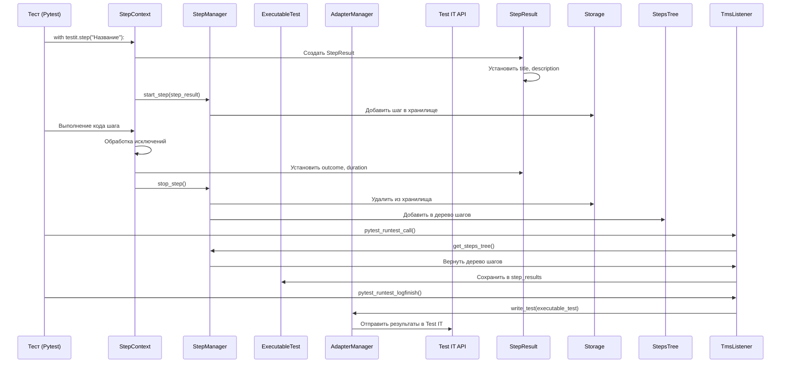

# Анализ проекта Test IT Python Integrations

## 1. Краткое описание проекта для не-питониста

**Что это такое?**
Это набор инструментов для интеграции Python-тестов с системой управления тестированием [Test IT](https://github.com/testit-tms/adapters-python).

**Что делает:**
- Позволяет автоматически отправлять результаты Python-тестов в Test IT
- Поддерживает популярные фреймворки: Pytest, Behave, RobotFramework, Nose
- Добавляет к тестам метаданные: описания, лейблы, ссылки, вложения
- Создает иерархическую структуру тестов с шагами

**Для кого:**
Для QA-инженеров, которые пишут автотесты на Python и используют Test IT для управления тестированием.

**Как работает:**
1. Пишете тесты на Python
2. Добавляете специальные пометки для Test IT
3. Запускаете тесты через адаптер
4. Результаты автоматически появляются в Test IT

## 2. Анализ функциональности обработки шагов теста

### 2.1. Ключевые компоненты

#### Модель шага (StepResult)
Файл: `testit-python-commons/src/testit_python_commons/models/step_result.py`
- Хранит данные о шаге: название, статус, описание, длительность, вложенные шаги, вложения
- Методы для установки и получения всех параметров шага

#### Менеджер шагов (StepManager)
Файл: `testit-python-commons/src/testit_python_commons/services/step_manager.py`
- Управляет деревом шагов (`__steps_tree`)
- Методы:
  - `start_step()` - начало шага (добавляет в хранилище)
  - `stop_step()` - завершение шага (перемещает из хранилища в дерево)
  - `get_steps_tree()` - возвращает дерево шагов и очищает его

#### Контекст шага (StepContext)
Файл: `testit-python-commons/src/testit_python_commons/step.py`
- Реализует контекстный менеджер для шагов (используется с `with`)
- В `__enter__()`:
  - Создает `StepResult`
  - Устанавливает название, описание, параметры
  - Вызывает `StepManager.start_step()`
- В `__exit__()`:
  - Устанавливает статус и длительность
  - Вызывает `StepManager.stop_step()`

#### Интеграция с pytest (TmsListener)
Файл: `testit-adapter-pytest/src/testit_adapter_pytest/listener.py`
- Ключевые методы:
  - `pytest_runtest_call()` - после выполнения теста получает дерево шагов через `step_manager.get_steps_tree()` и сохраняет в `executable_test.step_results`
  - `pytest_fixture_setup()` - аналогично обрабатывает шаги для фикстур

### 2.2. Диаграмма последовательности



## 3. Потенциальные проблемы и баги

### 3.1. Проблемы с обработкой исключений
- В `StepContext.__exit__()` логика определения статуса шага не учитывает все возможные сценарии
- Нет обработки случая, когда `get_pytest_check_outcome()` возвращает `None` или пустой результат
- Нет обработки случая, когда `exc_type` не является ошибкой (например, `SystemExit`)

### 3.2. Проблемы с временными метками
- В `StepContext.__enter__()` и `__exit__()` используются разные подходы к получению времени
- Нет установки `started_on` и `completed_on` в `StepResult`

### 3.3. Проблемы с параметрами
- В `StepContext.__call__()` параметры извлекаются через `Utils.get_function_parameters()`, но нет валидации типов параметров
- Нет обработки случая, когда параметры содержат несериализуемые объекты

### 3.4. Проблемы с потокобезопасностью
- `StepManager.__steps_tree` является статическим полем класса
- Нет механизма блокировки при доступе к общему состоянию

## 4. Проблемы архитектуры

### 4.1. Сильная связанность компонентов
- `StepContext` напрямую зависит от `TmsPluginManager`
- `StepManager` использует `StepResultStorage`, но нет интерфейса для хранения

### 4.2. Нарушение принципа единственной ответственности
- `StepContext` выполняет слишком много функций:
  - Управление временем
  - Создание и настройка `StepResult`
  - Взаимодействие с `StepManager`
  - Обработка исключений

### 4.3. Проблемы с расширяемостью
- Нет механизма для добавления кастомных обработчиков шагов
- Нет возможности переопределить логику определения статуса шага

## 5. Проблемы читаемости

### 5.1. Сложная логика в `StepContext.__exit__()`
- Вложенные тернарные операторы затрудняют понимание
- Лучше использовать явные условия с комментариями

### 5.2. Неясные названия переменных
- В `StepManager`: `__steps_tree`, `__storage`
- В `StepContext`: `__parameters`

### 5.3. Отсутствие комментариев
- Нет комментариев, объясняющих логику работы `StepManager`
- Нет документации для публичных методов

## 6. Оценка качества документации

### 6.1. Положительные стороны
- Есть примеры использования в README.md
- Есть описание декораторов и методов
- Есть примеры кода с разными сценариями использования

### 6.2. Проблемы документации
- Нет документации для внутренних классов и методов
- Нет описания архитектуры и взаимодействия компонентов
- Нет диаграмм последовательности или классов
- Нет описания жизненного цикла шагов

## 7. Совместимость с Python 3.8

### 7.1. Требования к версии Python
- В `setup.py` указаны классификаторы для Python 3.6-3.12
- Нет параметра `python_requires`, что означает поддержку всех версий Python 3.x

### 7.2. Анализ зависимостей
- Все основные зависимости (`attrs`, `pytest`, `pluggy`, `tomli`) поддерживают Python 3.8
- Потенциальные проблемы:
  - `importlib.metadata` может требовать установки отдельного пакета
  - `packaging` нужно установить отдельно

### 7.3. Вывод о совместимости
**Да, проект можно запустить на Python 3.8** с установкой дополнительных пакетов:
```bash
pip install importlib-metadata packaging
```

## 8. Коммит с добавлением сложных тернарных операций

### 8.1. Найденный коммит
**78a7589** (Release 2.0 #25) от 11 октября 2022 года

### 8.2. Сложные тернарные операции
В файле `step.py` присутствует сложная тернарная операция:
```python
outcome = 'Failed' if exc_type \
    else TmsPluginManager.get_plugin_manager().hook.get_pytest_check_outcome()[0] if \
    hasattr(TmsPluginManager.get_plugin_manager().hook, 'get_pytest_check_outcome') \
    else 'Passed'
```

### 8.3. Проблемы
- Сложность для понимания и поддержки
- Нет обработки случая, когда `get_pytest_check_outcome()` возвращает `None`
- Нет обработки случая, когда `exc_type` не является ошибкой

## 9. Промпты пользователя

1. **Первый промпт:**
   ```
   Проанализируй проект и составь краткое описнаие для не питониста
   ```

2. **Второй промпт:**
   ```
   найди те части исходного кода, которые отвечают за формирование и отправку резульатов выполнения шага теста для pytest
   составь диаграмму последовательности отправки данных
   ```

3. **Третий промпт:**
   ```
   проанализируй эту функциональность
   найди потенциальные баги
   проблемы архитектуры
   проблемы читаемости
   оцени качество документации
   отчёт сгруппируй по этим разделам
   ```

4. **Четвертый промпт:**
   ```
   возможно ли запустить код проекта на Python 3.8?
   ```

5. **Пятый промпт:**
   ```
   найди коммит в проекте, где были добавлены сложные тернарные операции?
   ```

6. **Шестой промпт:**
   ```
   собери все свои ответы в один структурированный md файл

   в конце добавь раздел, в который включи все мои промпты, включая этот
